# SpringBoot框架

# 1. SpringBoot概述

官网：https://spring.io/
Springboot：https://docs.spring.io/spring-boot/docs/2.2.4.RELEASE/reference/html/

随着动态语言的流行（Ruby、Node.js），Java的开发显得格外的笨重；繁多的配置、低下的开发效率、复杂的部署流程以及第三方技术集成难度大。
在上述环境下，Spring Boot应运而生，它的优势就是“习惯优于配置”（将原来项目中大量的配置内容，全部剔除掉，让你无须手动进行配置，即可轻松开发）的理念让你的项目快速运行起来。
使用Spring Boot很容易创建一个独立运行（运行jar，内嵌Servlet容器）、准生产级别的基于Spring框架的项目。为Spring平台及第三方库提供开箱即用的设置。使用Spring Boot可以不用或者只需要很少的spring配置。
Spring Boot并不是对Spring功能上的增强，而是提供了一种快速使用Spring的方式。

## 1.1. 特性

1. 创建独立的Spring应用程序

2. 嵌入的Tomcat，无需部署WAR文件

3. 简化Maven配置

4. 自动配置Spring

5. 提供非功能特性，如指标，健康检查和外部配置

6. 开箱即用，没有代码生成，也无需XML配置。

## 1.2. SpringBoot的目标

为基于Spring的开发提供更快的入门体验
开箱即用，没有代码生成，也无需XML配置。同时也可以修改默认值来满足特定的需求。
提供了一些大型项目中常见的非功能特性，如嵌入式服务器、安全、指标，健康检测、外部配置等。
绝对不需要代码生成及XML配置。 

## 1.3. 优点

快速构建项目
对主流开发框架的无配置集成
项目可独立运行，无须外部依赖Servlet容器
极大的提高了开发、部署效率
与云计算的天然集成

## 1.4. 缺点

目前书籍文档介绍不够深入，部分棘手问题查找需依赖Stack Overflow
如果不认可Spring框架，这也是它的缺点；

# 1.5. 版本

截止到2021年4月6日当前稳定的版本是  2.4.4

# 2. 创建第一个SpringBoot的项目

## 2.1. 使用start.spring.io

 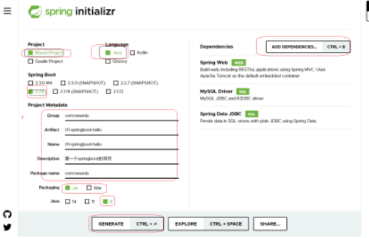

## 2.2. sts构建Spring Boot项目

Eclipse + spring插件:
https://spring.io/tools
 

## 2.3. Intellij IDEA构建Spring Boot项目

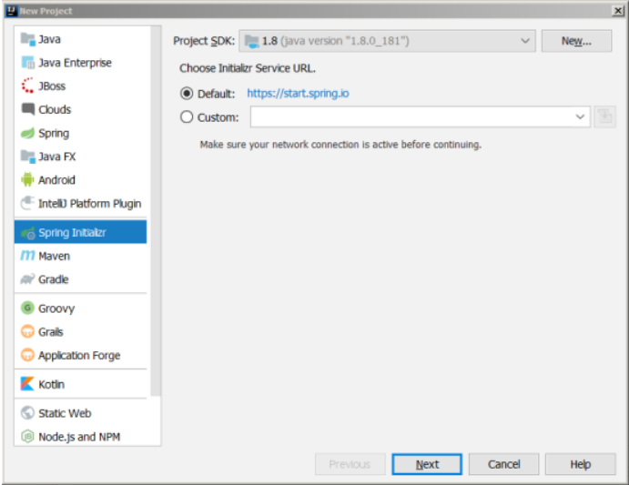
 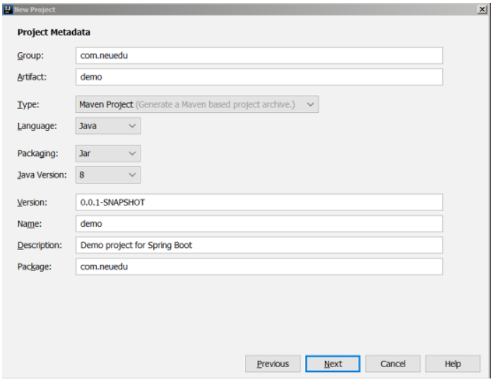
 
 

## 2.4. Maven方式构建

|__01-springboot-hello 

### 

#### 2.4.1. 创建maven工程


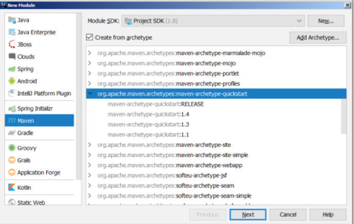
 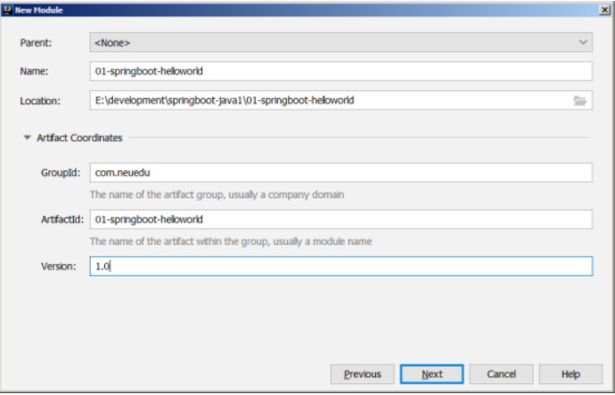
 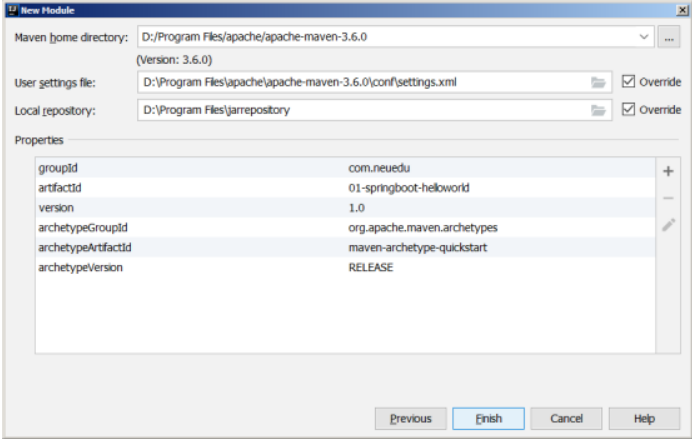


#### 2.4.2. 添加Springboot的依赖

修改pom.xml

##### 添加parent

```xml
<parent>
    <groupId>org.springframework.boot</groupId>
    <artifactId>spring-boot-starter-parent</artifactId>
    <version>2.4.4</version>
    <relativePath/> <!-- lookup parent from repository -->
 </parent>
```

修改打包方式

```xml
<packaging>jar</packaging>
```

添加依赖(starter)

```xml
<dependencies>
        <dependency>
            <groupId>org.springframework.boot</groupId>
            <artifactId>spring-boot-starter-web</artifactId>
        </dependency>
    </dependencies>
```

##### 完整的pom

```xml
<?xml version="1.0" encoding="UTF-8"?>
<project xmlns="http://maven.apache.org/POM/4.0.0"
         xmlns:xsi="http://www.w3.org/2001/XMLSchema-instance"
         xsi:schemaLocation="http://maven.apache.org/POM/4.0.0 http://maven.apache.org/xsd/maven-4.0.0.xsd">
    <modelVersion>4.0.0</modelVersion>
    <parent>
        <groupId>org.springframework.boot</groupId>
        <artifactId>spring-boot-starter-parent</artifactId>
        <version>2.4.4</version>
        <relativePath/> <!-- lookup parent from repository -->
    </parent>
    <groupId>com.neuedu</groupId>
    <artifactId>spring-boot-mvn</artifactId>
    <version>1.0-SNAPSHOT</version>
    <packaging>jar</packaging>
    <dependencies>
        <dependency>
            <groupId>org.springframework.boot</groupId>
            <artifactId>spring-boot-starter-web</artifactId>
        </dependency>
    </dependencies>
</project>
```

#### 2.4.2.3. 创建IndexController返回json数据

```java
package com.neuedu.mvn.controller;
import org.springframework.web.bind.annotation.RequestMapping;
import org.springframework.web.bind.annotation.RestController;
import java.util.HashMap;
import java.util.Map;
@RestController
public class UserController {
    /**
     * http://127.0.0.1:8080/index
     * @return
     */
    @RequestMapping("/index")
    Map hello(){
        Map map = new HashMap<>();
        map.put("success",true);
        map.put("msg","成功了");
        return map;
    }
}
```

#### 2.4.2.4. 入口程序启动

1. 在类上声明@SpringBootApplication注解

2. 添加启动的main函数
   
   ```java
   package com.neuedu.mvn;
   import org.springframework.boot.SpringApplication;
   import org.springframework.boot.autoconfigure.SpringBootApplication;
   @SpringBootApplication
   public class App {
    public static void main(String[] args) {
        SpringApplication.run(App.class,args);
    }
   }
   ```
2) 访问：
   http://127.0.0.1:8080/index 
   
   # 3. Springboot的启动器（Starter）
   
   1 Springboot预先定义好的一些library的集合,可以不用指定version，
   2 parent中定义好的，解决了版本冲突的依赖关系。    
   
   ## 3.1. 2.2.6的启动器定义
   
   https://docs.spring.io/spring-boot/docs/2.2.6.RELEASE/reference/html/using-spring-boot.html#using-boot-starter
   
   | Name                                          | Description                                                                                                                                                                                                                                                                                                                                                            |
   | --------------------------------------------- | ---------------------------------------------------------------------------------------------------------------------------------------------------------------------------------------------------------------------------------------------------------------------------------------------------------------------------------------------------------------------- |
   | `spring-boot-starter`                         | Core starter, including auto-configuration support, logging and YAML                                                                                                                                                                                                                                                                                                   |
   | `spring-boot-starter-activemq`                | Starter for JMS messaging using Apache ActiveMQ                                                                                                                                                                                                                                                                                                                        |
   | `spring-boot-starter-amqp`                    | Starter for using Spring AMQP and Rabbit MQ                                                                                                                                                                                                                                                                                                                            |
   | `spring-boot-starter-aop`                     | Starter for aspect-oriented programming with Spring AOP and AspectJ                                                                                                                                                                                                                                                                                                    |
   | `spring-boot-starter-artemis`                 | Starter for JMS messaging using Apache Artemis                                                                                                                                                                                                                                                                                                                         |
   | `spring-boot-starter-batch`                   | Starter for using Spring Batch                                                                                                                                                                                                                                                                                                                                         |
   | `spring-boot-starter-cache`                   | Starter for using Spring Framework’s caching support                                                                                                                                                                                                                                                                                                                   |
   | `spring-boot-starter-data-cassandra`          | Starter for using Cassandra distributed database and Spring Data Cassandra                                                                                                                                                                                                                                                                                             |
   | `spring-boot-starter-data-cassandra-reactive` | Starter for using Cassandra distributed database and Spring Data Cassandra Reactive                                                                                                                                                                                                                                                                                    |
   | `spring-boot-starter-data-couchbase`          | Starter for using Couchbase document-oriented database and Spring Data Couchbase                                                                                                                                                                                                                                                                                       |
   | `spring-boot-starter-data-couchbase-reactive` | Starter for using Couchbase document-oriented database and Spring Data Couchbase Reactive                                                                                                                                                                                                                                                                              |
   | `spring-boot-starter-data-elasticsearch`      | Starter for using Elasticsearch search and analytics engine and Spring Data Elasticsearch                                                                                                                                                                                                                                                                              |
   | `spring-boot-starter-data-jdbc`               | Starter for using Spring Data JDBC                                                                                                                                                                                                                                                                                                                                     |
   | `spring-boot-starter-data-jpa`                | Starter for using Spring Data JPA with Hibernate                                                                                                                                                                                                                                                                                                                       |
   | `spring-boot-starter-data-ldap`               | Starter for using Spring Data LDAP                                                                                                                                                                                                                                                                                                                                     |
   | `spring-boot-starter-data-mongodb`            | Starter for using MongoDB document-oriented database and Spring Data MongoDB                                                                                                                                                                                                                                                                                           |
   | `spring-boot-starter-data-mongodb-reactive`   | Starter for using MongoDB document-oriented database and Spring Data MongoDB Reactive                                                                                                                                                                                                                                                                                  |
   | `spring-boot-starter-data-neo4j`              | Starter for using Neo4j graph database and Spring Data Neo4j                                                                                                                                                                                                                                                                                                           |
   | `spring-boot-starter-data-r2dbc`              | Starter for using Spring Data R2DBC                                                                                                                                                                                                                                                                                                                                    |
   | `spring-boot-starter-data-redis`              | Starter for using Redis key-value data store with Spring Data Redis and the Lettuce client                                                                                                                                                                                                                                                                             |
   | `spring-boot-starter-data-redis-reactive`     | Starter for using Redis key-value data store with Spring Data Redis reactive and the Lettuce client                                                                                                                                                                                                                                                                    |
   | `spring-boot-starter-data-rest`               | Starter for exposing Spring Data repositories over REST using Spring Data REST                                                                                                                                                                                                                                                                                         |
   | `spring-boot-starter-data-solr`               | Starter for using the Apache Solr search platform with Spring Data Solr. Deprecated since 2.3.9                                                                                                                                                                                                                                                                        |
   | `spring-boot-starter-freemarker`              | Starter for building MVC web applications using FreeMarker views                                                                                                                                                                                                                                                                                                       |
   | `spring-boot-starter-groovy-templates`        | Starter for building MVC web applications using Groovy Templates views                                                                                                                                                                                                                                                                                                 |
   | `spring-boot-starter-hateoas`                 | Starter for building hypermedia-based RESTful web application with Spring MVC and Spring HATEOAS                                                                                                                                                                                                                                                                       |
   | `spring-boot-starter-integration`             | Starter for using Spring Integration                                                                                                                                                                                                                                                                                                                                   |
   | `spring-boot-starter-jdbc`                    | Starter for using JDBC with the HikariCP connection pool                                                                                                                                                                                                                                                                                                               |
   | `spring-boot-starter-jersey`                  | Starter for building RESTful web applications using JAX-RS and Jersey. An alternative to [`spring-boot-starter-web`](https://docs.spring.io/spring-boot/docs/current/reference/html/using-spring-boot.html#spring-boot-starter-web)                                                                                                                                    |
   | `spring-boot-starter-jooq`                    | Starter for using jOOQ to access SQL databases. An alternative to [`spring-boot-starter-data-jpa`](https://docs.spring.io/spring-boot/docs/current/reference/html/using-spring-boot.html#spring-boot-starter-data-jpa) or [`spring-boot-starter-jdbc`](https://docs.spring.io/spring-boot/docs/current/reference/html/using-spring-boot.html#spring-boot-starter-jdbc) |
   | `spring-boot-starter-json`                    | Starter for reading and writing json                                                                                                                                                                                                                                                                                                                                   |
   | `spring-boot-starter-jta-atomikos`            | Starter for JTA transactions using Atomikos                                                                                                                                                                                                                                                                                                                            |
   | `spring-boot-starter-jta-bitronix`            | Starter for JTA transactions using Bitronix. Deprecated since 2.3.0                                                                                                                                                                                                                                                                                                    |
   | `spring-boot-starter-mail`                    | Starter for using Java Mail and Spring Framework’s email sending support                                                                                                                                                                                                                                                                                               |
   | `spring-boot-starter-mustache`                | Starter for building web applications using Mustache views                                                                                                                                                                                                                                                                                                             |
   | `spring-boot-starter-oauth2-client`           | Starter for using Spring Security’s OAuth2/OpenID Connect client features                                                                                                                                                                                                                                                                                              |
   | `spring-boot-starter-oauth2-resource-server`  | Starter for using Spring Security’s OAuth2 resource server features                                                                                                                                                                                                                                                                                                    |
   | `spring-boot-starter-quartz`                  | Starter for using the Quartz scheduler                                                                                                                                                                                                                                                                                                                                 |
   | `spring-boot-starter-rsocket`                 | Starter for building RSocket clients and servers                                                                                                                                                                                                                                                                                                                       |
   | `spring-boot-starter-security`                | Starter for using Spring Security                                                                                                                                                                                                                                                                                                                                      |
   | `spring-boot-starter-test`                    | Starter for testing Spring Boot applications with libraries including JUnit Jupiter, Hamcrest and Mockito                                                                                                                                                                                                                                                              |
   | `spring-boot-starter-thymeleaf`               | Starter for building MVC web applications using Thymeleaf views                                                                                                                                                                                                                                                                                                        |
   | `spring-boot-starter-validation`              | Starter for using Java Bean Validation with Hibernate Validator                                                                                                                                                                                                                                                                                                        |
   | `spring-boot-starter-web`                     | Starter for building web, including RESTful, applications using Spring MVC. Uses Tomcat as the default embedded container                                                                                                                                                                                                                                              |
   | `spring-boot-starter-web-services`            | Starter for using Spring Web Services                                                                                                                                                                                                                                                                                                                                  |
   | `spring-boot-starter-webflux`                 | Starter for building WebFlux applications using Spring Framework’s Reactive Web support                                                                                                                                                                                                                                                                                |
   | `spring-boot-starter-websocket`               | Starter for building WebSocket applications using Spring Framework’s WebSocket support                                                                                                                                                                                                                                                                                 |
   
   # 4 .常见的项目结构
   
   MyPrarent (依赖于springbooot-parent)
   ​    |__ Module1
   ​    |__Module2
1. MyPrarent 添加 parent

2. Module1 添加依赖 (parent: MyPrarent ):mysql、web 。。。。。
   
   # 5 项目的简单配置
   
   ## 5.1 Controller
   
   在启动类所在的包或者子包
   
   ## 5.2 Springboot的配置文件
   
   SpringBoot的配置文件，可以以properties、yaml、yml为扩展名，名字：application
- application.properties
  键值对的形式，key=value   server.port=9090
  
  ```properties
  server.port=80
  ```

- application.yml
  ​    以树形结构书写，有上下级关系    ,最终会解析成 properties
  
  ```yaml
  server:
  port: 9090
  ```
  
  其他通用的默认配置参考：
  https://docs.spring.io/spring-boot/docs/current/reference/html/appendix-application-properties.html#common-application-properties-server
  
  # 6. Springboot的单元测试
  
  ## 6.1. 引入依赖
  
  ```xml
  <dependency>
    <groupId>org.springframework.boot</groupId>
    <artifactId>spring-boot-starter-test</artifactId>
  </dependency> 
  ```

## 6.2. 单元测试类

单元测试类编写

```java
package com.neuedu;
import com.neuedu.his.His01App;
import com.neuedu.his.controller.HelloController;
import org.junit.jupiter.api.BeforeEach;
import org.junit.jupiter.api.Test;
import org.springframework.beans.factory.annotation.Autowired;
import org.springframework.boot.test.autoconfigure.web.servlet.AutoConfigureMockMvc;
import org.springframework.boot.test.context.SpringBootTest;
import org.springframework.http.MediaType;
import org.springframework.test.context.ContextConfiguration;
import org.springframework.test.context.web.WebAppConfiguration;
import org.springframework.test.web.servlet.MockMvc;
import org.springframework.test.web.servlet.MvcResult;
import org.springframework.test.web.servlet.request.MockMvcRequestBuilders;
import org.springframework.test.web.servlet.result.MockMvcResultHandlers;
import org.springframework.test.web.servlet.result.MockMvcResultMatchers;
import org.springframework.test.web.servlet.setup.MockMvcBuilders;
import org.springframework.web.context.WebApplicationContext;
@SpringBootTest(classes= His01App.class)
@AutoConfigureMockMvc  //相当于是使用 context 上下文构造一个 mvc对象
public class MVCTest {
    //模拟访问  Controller
    @Autowired
    MockMvc mvc;
    @Test
    public void test() throws Exception {
        MvcResult result = mvc.perform(
                MockMvcRequestBuilders.get("/index").
                        accept(MediaType.APPLICATION_JSON)).
                andExpect(MockMvcResultMatchers.status().isOk()).
                andDo(MockMvcResultHandlers.print()).andReturn();
    }
}
```

- perform：执行一个RequestBuilder请求，会自动执行SpringMVC的流程并映射到相应的控制器执行处理；

- get:声明发送一个get请求的方法。MockHttpServletRequestBuilder get(String urlTemplate, Object... urlVariables)：根据uri模板和uri变量值得到一个GET请求方式的。另外提供了其他的请求的方法，如：post、put、delete等。

- andExpect：添加ResultMatcher验证规则，验证控制器执行完成后结果是否正确（对返回的数据进行的判断）；

- andDo：添加ResultHandler结果处理器，比如调试时打印结果到控制台（对返回的数据进行的判断）；

- andReturn：最后返回相应的MvcResult；然后进行自定义验证/进行下一步的异步处理（对返回的数据进行的判断）； 
  
  # 7. Springboot热部署(IDEA)
  
  ## 7.1. 添加devtools的依赖
  
  ```xml
  <!--devtools-->
  <dependency>
    <groupId>org.springframework.boot</groupId>
    <artifactId>spring-boot-devtools</artifactId>
  </dependency>
  ```
  
  ## 7.2. 在maven-plugin上添加configration
  
  ```xml
  <build>
        <plugins>
            <plugin>
                <groupId>org.springframework.boot</groupId>
                <artifactId>spring-boot-maven-plugin</artifactId>
                <configuration>
                    <fork>true</fork>
                </configuration>
            </plugin>
        </plugins>
    </build>
  ```

## 7.3. 修改idea的配置，自动编译

File-Settings-Build,Execution...--Compiler

 

## 7.4. 修改idea允许在程序运行过程中编译

快捷键键
CTRL+SHIFT+ALT+/
 
 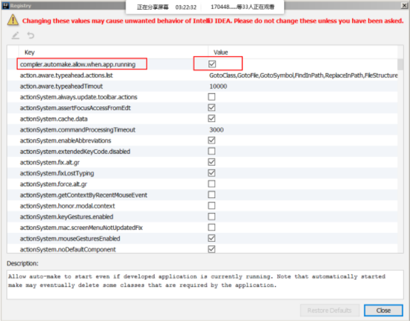

## 7.5. 测试热部署

程序启动过程中，修改方法。当修改代码后idea失去焦点之后会触发springboot的重启

# 10. 集成jsp

## 10.1 添加tomcat的jasper类库

SpringBoot-starter-web内嵌的Tomcat无法解析jsp（Thymeleaf）,需要额外添加类库:Jasper

```xml
  <!-- 解析jsp类库  -->
<dependency>
    <groupId>org.apache.tomcat.embed</groupId>
    <artifactId>tomcat-embed-jasper</artifactId>
</dependency>
```

## 10.2. webapp

添加上下文目录
打开项目结构创建web上下文File--Project Structure

### 10.2.1. 打开项目结构

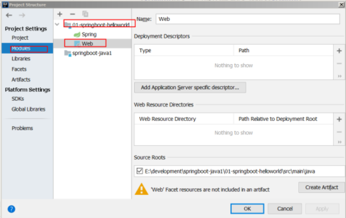
 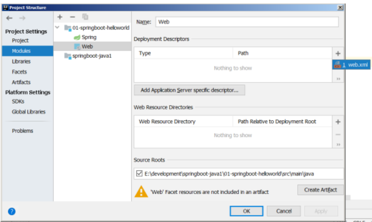


### 10.2.2. 指定上下文的目录


 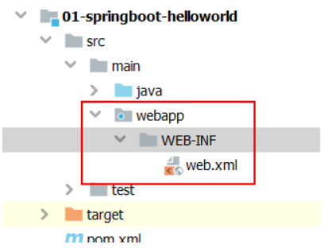

### 10.2.3 指定springboot的启动目录


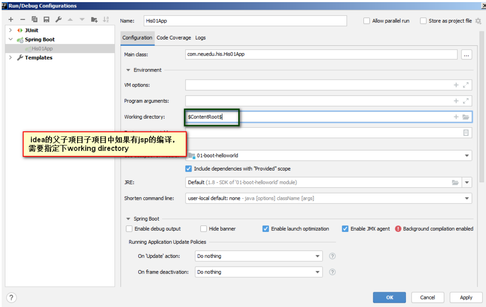

## 10.3. 创建jsp

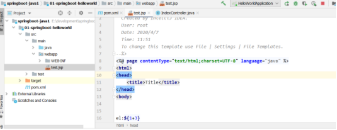

### 10.3.1. 测试是否可以用

# 11. 对json的支持

不需要额外的配置，直接开箱即用。

- 返回字符串

- 返回pojo对象

- 返回集合对象

- 返回Map对象
  
  ## 11.1. Controller
  
  ```java
  package com.neuedu.his.controller;
  import com.neuedu.entity.User;
  import org.springframework.web.bind.annotation.RequestMapping;
  import org.springframework.web.bind.annotation.RestController;
  import java.time.Instant;
  import java.time.LocalDate;
  import java.time.LocalDateTime;
  import java.time.LocalTime;
  import java.util.*;
  @RestController
  @RequestMapping("/json")
  public class JsonController {
    @RequestMapping("/getString")
    String getString(){
        return new Date().toString();
    }
    @RequestMapping("getMap")
    Map getMap(){
        HashMap<Object, Object> map = new HashMap<>();
        map.put("time",new Date().getTime());
        return map;
    }
    @RequestMapping("getList")
    List getList(){
        List list = new ArrayList();
        for (int i = 0; i < 10; i++) {
            HashMap<Object, Object> map = new HashMap<>();
            map.put("time",new Date().getTime());
            list.add(map);
        }
        return list;
    }
    @RequestMapping("getUser")
    User getUser(){
        User user = new User();
        user.setId("100");
        user.setAge(100);
        user.setAddress("黑龙江省大庆市龙凤区");
        return user;
    }
  }
  ```
  
  ## 11.2 对日期的格式化
  
  ```properties
  spring:
  jackson:
    date-format: yyyy-MM-dd HH:mm:ss
    time-zone: GMT+8
  ```
  
  # 12. Springboot的核心配置
  
  Springboot不推荐使用xml配置，推荐使用JavaConfig的形式配置，@Configuration,@Bean
  
  ## 12.1 常用注解

- 注解@Configuration 
  通过该注解来表明该类是一个Spring的配置，相当于一个xml文件

- 注解@Bean
  作用于方法上，相当于xml配置中的`<bean>` 
  
  ```java
  package com.neuedu.config.configuration;
  import com.neuedu.config.service.UserService;
  import org.springframework.context.annotation.Bean;
  import org.springframework.context.annotation.Configuration;
  @Configuration
  public class AppConfig {
    @Bean("userService")  //<Bean >
    public UserService getUserService(){
        return new UserService();
    }
  ```

}

```java
- 注解@ComponentScan
  配置扫描包
  通过该注解自动收集所有的Spring组件，包括 @Configuration 类
  basePackages,指定扫描的基准包，其中包含基包和它的子包
```java
package com.neuedu.config;
import org.springframework.boot.SpringApplication;
import org.springframework.boot.autoconfigure.SpringBootApplication;
import org.springframework.context.annotation.ComponentScan;
@SpringBootApplication(scanBasePackages={
        "com.neuedu",
        "com.neuedu.config"
})
//@ComponentScan
public class App02 {
    public static void main(String[] args) {
        SpringApplication.run(App02.class, args);
    }
}
```

## 12.2 读取默认的配置文件

​    读取application.yml/properties默认配置文件， 在Bean中声明属性，在属性上编写@Value注解

```java
package com.neuedu.config.configuration;
import org.springframework.beans.factory.annotation.Value;
import org.springframework.context.annotation.Configuration;
import java.util.ResourceBundle;
/**
 * server:
 *   port: 80
 * #  servlet:
 * #    context-path: /
 * spring:
 *   application:
 *     name: MyConfig
 *
 * neuedu:
 *   datasource:
 *     user: root
 *     password: 123456
 */
@Configuration
public class YmlConfig {
    @Value("${spring.application.name}")
    private String appName;
    @Value("${server.port}")
    private Integer  serverPort;
    @Value("${neuedu.datasource.user}")
    private String dataUserName;
    @Value("${neuedu.datasource.password}")
    private String dataPassword;
    public String getAppName() {
        return appName;
    }
    public void setAppName(String appName) {
        this.appName = appName;
    }
    public Integer getServerPort() {
        return serverPort;
    }
    public void setServerPort(Integer serverPort) {
        this.serverPort = serverPort;
    }
    public String getDataUserName() {
        return dataUserName;
    }
    public void setDataUserName(String dataUserName) {
        this.dataUserName = dataUserName;
    }
    public String getDataPassword() {
        return dataPassword;
    }
    public void setDataPassword(String dataPassword) {
        this.dataPassword = dataPassword;
    }
}
```

## 12.3. 读取外部的属性配置文件

- 创建jdbc.properties
  
  ```properties
  jdbc.url=jdbc:mysql://localhost:3306/mybatis jdbc.name=root jdbc.password=root 
  ```

- 创建配置类 @Configuration

- 在配置类上声明 @PropertySource(value="classpath:jdbc.properties")注解
  
  - value属性表明，读取的
  - 如果配置文件不存在，则默认报错，可以添加ignoreResourceNotFound属性（true）,忽略掉找不到的资源

- 在配置类中声明属性，使用@Value注解读取配置文件中的内容
  
  ```java
  package com.neuedu.config.configuration;
  import org.springframework.beans.factory.annotation.Value;
  import org.springframework.context.annotation.Bean;
  import org.springframework.context.annotation.Configuration;
  import org.springframework.context.annotation.PropertySource;
  @Configuration
  @PropertySource(value="classpath:jdbc.properties")
  public class OtherConfigFile {
    @Value("${jdbc.url}")
    private String url;
    @Bean("url")
    String getUrl(){
        System.out.println("url = " + url);
        return url;
    }
  ```

}

## 12.4. 导入其他配置

@Import 注解，导入其他配置类
@Import(SysConfig.class)
@ImportResources 注解，导入其他配置文件xml类型的
@ImportResource("classpath:springmvc.xml")
@ComponentScan 扫描组件的（Controller、servce、Configuration）

## 12.5. 自动配置

​ 执行main为什么就能启动Tomcat?

### 12.5.2. 代码跟踪

#### 12.5.2.1. @SpringBootApplication注解


#### 12.5.2.2. @EnableAutoConfiguration

   

使用自动配置的bean名称初始化Bean 

#### 12.5.2.3. 拿Tomcat为例


### 12.5.3. 条件注解

 

关闭自动配置
在SpirngbootApplication注解中添加exclude属性指定哪些自动配置类，忽略（关闭） 

## 12.6. SpringBootApplication注解

@SpringBootConfiguration 相当于Configuration
@EnableAutoConfiguration 自动配置
@ComponentScan 包扫描

## 12.7. 配置文件

默认的配置文件
application.properties
application.yml 底层会转换成properties文件  
默认的属性文件 https://docs.spring.io/spring-boot/docs/2.2.6.RELEASE/reference/html/appendix-application-properties.html#common-application-properties 

## 12.6. SpringBoot日志

常见的日志框架 common-logging、 slf4j、logback 、log4j、log4j2
TRACE、DEBUG、INFO、ERROR、FALT
Springboot默认使用slf4j和logback
默认级别是INFO
通过logger.
slf4j ：面向日志的接口
具体的日志实现:logback


### 12.6.1. 测试Controller

```java
@RestController
public class HelloConfigController {
    Logger logger = LoggerFactory.getLogger(HelloConfigController.class);
    /**
     * http://127.0.0.1/index
     * @return
     */
    @RequestMapping("/index")
    String hello(){
        logger.info("访问RestController");
        return "index";
    }
}
```

### 12.6.2. 默认级别

 

### 12.6.3. 调整后的级别

 
 

## 12.7. Profiles

通过profiles切换不同环境的配置文件
Profile是Spring用来针对不同的环境对不同的配置提供支持的，全局Profile配置使用application-{profile}.properties。
通过在application.properties中设置spring.profiles.active=prod来指定活动的Profile。
示例：有两个环境分别为生产(prod)和开发(dev)环境，生产环境下端口号为80，开发环境下端口为8088

 
 

### 8.7.1. 也可以在虚拟机上配置执行参数

 

# 13. Spring Boot的Web开发支持

使用spring-boot-starter-web启动器，开始web支持，内嵌一个Tomcat，添加了对于SpringMVC的支持。Spring Boot默认servlet容器为tomcat。
 Spring Boot supports the following embedded servlet containers:
| Name         | Servlet Version |
| ------------ | --------------- |
| Tomcat 9.0   | 4.0             |
| Jetty 9.4    | 3.1             |
| Undertow 2.0 | 4.0             |

## 13.1. 常用的服务器配置

配置端口号Spring Boot 默认端口是8080，如果想要进行更改的话，在配置文件中加入：server.port=8081 配置context-pathserver.servlet.context-path=/spring-boot访问地址就是http://ip:port/spring-boot 
配置session的超时时间server.servlet.session.timeout=2M
 全量的配置内容
https://docs.spring.io/spring-boot/docs/2.2.6.RELEASE/reference/html/appendix-application-properties.html#common-application-properties

## 13.2. 替换Tomcat

使用jetty服务器替换Tomcat

### 13.2.1. 创建springboot的项目，编写Controller测试

1) 创建maven项目（quickstart）

2) Maven项目添加parent 

3) 添加web启动器、
   4 编写Controller 测试
   
   ```java
   package com.neuedu.jetty.contoller;
   import org.springframework.web.bind.annotation.GetMapping;
   import org.springframework.web.bind.annotation.RestController;
   @RestController
   public class JettyController {
    /**
     * http://127.0.0.1/index
     * @return
     */
    @GetMapping("/index")
    String jettyMain(){
        return "欢迎访问 jetty..";
    }
   } 
   ```

4) 编写入口程序
   
   ```java
   package com.neuedu.jetty;
   import org.springframework.boot.SpringApplication;
   import org.springframework.boot.autoconfigure.SpringBootApplication;
   @SpringBootApplication
   public class App03 {
    public static void main(String[] args) {
        SpringApplication.run(App03.class, args);
    }
   }
   ```
   
   ### 9.2.2. 测试Tomcat

### 9.2.3. 引入jetty的启动器

   排除Tomcat的启动器
   也不能引入jasper，因为jasper会依赖Tomcat。

```xml
<dependencies>
 <dependency>
     <groupId>org.springframework.boot</groupId>
     <artifactId>spring-boot-starter-web</artifactId>
     <exclusions>
         <exclusion>
             <groupId>org.springframework.boot</groupId>
             <artifactId>spring-boot-starter-tomcat</artifactId>
         </exclusion>
     </exclusions>
 </dependency>
 <dependency>
     <groupId>org.springframework.boot</groupId>
     <artifactId>spring-boot-starter-jetty</artifactId>
 </dependency>
</dependencies>
```

## 13.3. Jetty对jsp的支持

springboot中的jetty为内嵌的jetty，支持jsp需要添加额外的依赖

```xml
  <!--jetty容器支持jsp start-->
        <dependency>
            <groupId>org.eclipse.jetty</groupId>
            <artifactId>jetty-server</artifactId>
        </dependency>
        <dependency>
            <groupId>org.eclipse.jetty</groupId>
            <artifactId>apache-jsp</artifactId>
        </dependency>
        <dependency>
            <groupId>org.eclipse.jetty</groupId>
            <artifactId>apache-jstl</artifactId>
        </dependency>
 <!--jetty容器支持jsp end-->
```

### 13.3.1. 创建了一个控制器

### 13.3.2. 编写了一个jsp

## 13.4. 自动配置的ViewResolver

在WebMvcAutoConguration类中有一个内置的Bean InternalResourceViewResolver

通过WebMvcProperties配合所有的mvc的属性前缀spring.mvc
在属性文件中配置视图解析器解析jsp的前后缀

### 13.4.1. 配置视图解析器：

## 13.5打包时对jsp的影响

boot程序打包是需要添加maven插件

```xml
  <build>
        <plugins>
            <plugin>
                <groupId>org.springframework.boot</groupId>
                <artifactId>spring-boot-maven-plugin</artifactId>
                <configuration>
                    <fork>true</fork>
                </configuration>
            </plugin>
        </plugins>
    </build>
```

boot默认打jar包，没有编译jsp的目录，如果需要使用jsp，则修改打包方式为 war,启动的命令

```bash
java -jar xxxxxx.war
```

## 13.6. 对静态资源的配置

在 WebMvcAutoConfiguration 类中的静态类 WebMvcAutoConfigurationAdapter 中，可以找到其对静态资源的相关自动配置，包括

### 13.6.1. 类路径文件：

把类路径下的 /static、/public、/resources 和 /META-INF/resources 文件夹下的静态文件直接映射为 /，可以直接通过 http://localhost:8080/ 访问。和 Spring MVC 中自定义 addResourceHandler、addResourceLocations 的原理一样。

### 13.6.2. webjar：

就是一种 jar 包，即将常用的 web 脚本框架封装在 jar 包中，然后再整个封装的 jar 包。关于更多可以访问官网 http://www.webjars.org。
把 webjar 的 /META-INF/resources/webjars/ 下的静态文件映射为 /webjar/，，可以通过 http://localhost:8080/webjar/ 访问。

 
资源文件的配置类ResourceProperties

 
静态资源文件位置
     

 

### 13.6.3. 自定义静态资源的映射关系

Spring Boot的静态资源配置有两项

- spring.mvc.static-path-pattern:
  
  - 代表的含义是我们应该以什么样的路径来访问静态资源，即用于阐述HTTP请求地址

- spring.resources.static-locations
  
  - 配置Spring Boot应该在何处查找静态资源文件，这是一个列表性的配置，查找文件时会依赖于配置的先后顺序依次进行，默认的官方配置如下
    ，默认的官方配置如下
    
    ```properties
    spring.mvc.static-path-pattern=/
    spring.resources.static-locations= classpath:/static,classpath:/public,classpath:/resources,classpath:/META-INF/resources
    ```

- 自定义配置静态资源的映射关系 
  
  ```properties
  spring.mvc.static-path-pattern=/st/
  spring.resources.static-locations=classpath:/mystatic,classpath:/static,classpath:/public,classpath:/resources,classpath:/META-INF/resources
  ```

 

## 13.7. Convert和Formatter

Convert、Formatter
：用于接收浏览器请求的参数自动转化成响应类型的数据Stirng（1988-01-01）-Date（1988-01-01）

### 13.7.1. User实体

### 13.7.2. UserController接受实体参数

```java
package com.neuedu.entity;
import java.util.Date;
//@Data
public class User {
    private String id;
    private Integer age;
    private String address;
    private Date createTime;
    public String getId() {
        return id;
    }
    public void setId(String id) {
        this.id = id;
    }
    public Integer getAge() {
        return age;
    }
    public void setAge(Integer age) {
        this.age = age;
    }
    public String getAddress() {
        return address;
    }
    public void setAddress(String address) {
        this.address = address;
    }
    public Date getCreateTime() {
        return createTime;
    }
    public void setCreateTime(Date createTime) {
        this.createTime = createTime;
    }
    @Override
    public String toString() {
        return "User{" +
                "id='" + id + '\'' +
                ", age=" + age +
                ", address='" + address + '\'' +
                ", createTime=" + createTime +
                '}';
    }
}
package com.neuedu.controller;
import com.neuedu.entity.User;
import org.springframework.web.bind.annotation.GetMapping;
import org.springframework.web.bind.annotation.RestController;
@RestController
public class ConverterController {

    /**
     * http://127.0.0.1:8080/user?createTime=2021-04-07
     * @param user
     * @return
     */
    @GetMapping("/user")
    User getUserInfo(User user){
        return user;
    }

}
```

### 13.7.3. 请求路径：

```http
http://127.0.0.1:8080/user?createTime=2021-04-07
```

 默认接受日期类型是报错（原因是string类型没有自动转换成java.util.Date）
 

### 9.6.4. 配置自定义的Convert解决日期类型的参数转换

声明一个Bean类型Convert的子类

```java
package com.neuedu.config;
import org.springframework.core.convert.converter.Converter;
import java.text.ParseException;
import java.text.SimpleDateFormat;
import java.util.Date;
public class DateConverter implements Converter<String, Date> {
    /**
     * yyyy-MM-dd
     * @param source
     * @return
     */
    @Override
    public Date convert(String source) {
        try {
            return new SimpleDateFormat("yyyy-MM-dd HH:mm:ss").parse(source);
        } catch (ParseException e) {
            e.printStackTrace();
        }
        return null;
    }
}
```

## 13.8. HttpMessageConverters

作用：将不同类型的对象转换成http消息输出到浏览器中:
自动注册的 HttpMessageConverter，
除了 Spring MVC 默认的
ByteArrayHttpMessageConverter
StringHttpMessageConverter
ResourceHttpMessageConverter 文件下载的时候可以依赖
SourceHttpMessageConverter
AllEncompassingFormHttpMessageConverter 
在类路径上自动配置了一些其他的类型
 

## 13.9. Jackson的配置

1) 配置格式化字符串 (全局)
2) 设置时区 GMT+8
    

### 13.9.1. 对Controller设置日期格式

请求的时候绑定变量,将当前的Controller中所有日期都使用一种格式
 

### 13.9.2. 对实体中的属性进行单独设置格式

1) 接受字符串格式的设置
   在实体的属性上添加@DateFormat注解

2) 响应字符串的格式设置
   在实体的属性上添加@JsonFormat注解
    
   
   ### 13.9.3. 响应json字符串中日期设置：
   
   1 使用spring.jackcon.dataFormat设置全局的
   2 对于特殊的格式单独使用JsonFormat注解实现个性化的日期格式
   
   ## 13.10. 日期格式的总结:
   
   ### 13.10.1. 请求:

3) 使用DateFormat注解 可以指定格式
   在某一个字段上指定

4) 在Controller中添加@InitBinder注解方法，注册Controller全局的格式编辑器
   当前Controller都会生效，无论什么字段都按照一个格式处理，有局限性

5) 使用Convert
   全局的转换器，可以自定义转换方式，实现多种日期格式的接受
   
   ### 13.10.2. 响应（Jackson）:
   
   1 ） 在全局配置文件中定义jsckson的dateFormat
   所有日期都会按照一个格式响应，可以将比较常用的格式在dateFormat中声明
   2） 在实体的属性上声明@JsonFormat注解(优先级比配置文件的声明高)
   将个性化的日期使用JsonFormat去格式化。
   
   # 14. Spring Boot的MVC开发配置
   
   ## 14.1. 新建项目
   
   03-springboot-mvc
    
   
   ## 14.2. 自定义拦截器的配置
   
   实现基础springmvc的拦截器
   
   ### 14.2.1. 自定义类实现HandlerInterceptor接口
   
   ```java
   package com.neuedu.config;
   import org.springframework.web.servlet.HandlerInterceptor;
   import org.springframework.web.servlet.ModelAndView;
   import javax.servlet.http.HttpServletRequest;
   import javax.servlet.http.HttpServletResponse;
   public class MyInterceptor implements HandlerInterceptor {
    @Override
    public boolean preHandle(HttpServletRequest request, HttpServletResponse response, Object handler) throws Exception {
        System.out.println("MyInterceptor.preHandle");
        return true;
    }
    @Override
    public void postHandle(HttpServletRequest request, HttpServletResponse response, Object handler, ModelAndView modelAndView) throws Exception {
        System.out.println("MyInterceptor.postHandle");
    }
    @Override
    public void afterCompletion(HttpServletRequest request, HttpServletResponse response, Object handler, Exception ex) throws Exception {
        System.out.println("MyInterceptor.afterCompletion");
    }
   }
   ```
   
   ### 14.2.2. 使用Java的形式配置拦截器的拦截路径
   
   在WebMvcConfig中注册拦截器,实现WebMvcConfigrer接口，并声明Bean
   
   ```java
   package com.neuedu.config;
   import org.springframework.context.annotation.Configuration;
   import org.springframework.format.FormatterRegistry;
   import org.springframework.web.servlet.HandlerExceptionResolver;
   import org.springframework.web.servlet.config.annotation.InterceptorRegistry;
   import org.springframework.web.servlet.config.annotation.ResourceHandlerRegistry;
   import org.springframework.web.servlet.config.annotation.WebMvcConfigurer;
   import java.util.List;
   /**
   * proxyBeanMethods = false 让当前的类在IOC容器中 不产生 代理对象
   */
   @Configuration(proxyBeanMethods = false)
   public class BootWebMvcConfig implements WebMvcConfigurer {
    @Override
    public void addFormatters(FormatterRegistry registry) {
        registry.addConverter(new DateConverter()); //添加了日期转换
    }
    @Override
    public void addInterceptors(InterceptorRegistry registry) {
        //注册拦截
        registry.addInterceptor(new MyInterceptor()).addPathPatterns("/**");
    }
    @Override
    public void addResourceHandlers(ResourceHandlerRegistry registry) {
    }
    @Override
    public void configureHandlerExceptionResolvers(List<HandlerExceptionResolver> resolvers) {
    }
   }
   ```
   
   ## 14.3. 自定义页面跳转
   
   在WebMvcConfiger的实现类中重写addViewConroller方法
    
    
   
   ## 14.5. 自定义资源映射
   
   1、自动配置（在全局额配置文件中修改）
   spring.mvc.static-path-pattern=/
   spring.resources.static-locations= classpath:/static,classpath:/public,classpath:/resources,classpath:/META-INF/resources

2、自定义资源路径
自定义资源映射,重写WebMvcConfiger实现类的 重写addResourceHandler 方法
调用：addResourceHandler 用于处理哪些路径是静态资源
调用：addResourceLocations用于指定静态资源的实际目录
此方法会覆盖配置文件和默认的静态资源配置

```java
 @Override
    public void addResourceHandlers(ResourceHandlerRegistry registry) {
        /**
         * http://127.0.0.1:8080/images/holiday.png
         */
//        registry.addResourceHandler()
//        registry.addResourceHandler("/images/").addResourceLocations("classpath:/imgs/");
        registry.addResourceHandler("/images/**").
                addResourceLocations("classpath:/imgs/",
                        "classpath:/mystatic/" ,
                        "classpath:/static/" ,
                        "classpath:/public/" ,
                        "classpath:/META-INF/resources",
                        "classpath:/resources");
    }
```

 

## 14.6. 错误处理、异常处理

错误的类型，
1） 因为后台程序出错导致的Exception（http 500）,
2） 因为参数传递错误（http 400）
3） 客户端的原因造成的路径不对（http 404）
当有错误产生，默认跳转到/error，指向的是BasicErrorController

定制错误响应
1、有模板引擎的情况下；error/状态码; 【将错误页面命名为 错误状态码.html 放在模板引擎文件夹里面的error文件夹下】，发生此状态码的错误就会来到对应的页面；
2、没有模板引擎（模板引擎找不到这个错误页面），静态资源文件夹下找；
3、以上都没有错误页面，就是默认来到Spring Boot默认的错误提示页面；
可以使用4xx和5xx作为错误页面的文件名来匹配这种类型的所有错误，精确优先（优先寻找精确的状态码.html）；
页面能获取的信息：
timestamp：时间戳
status：状态码
error：错误提示
exception：异常对象
message：异常消息
errors：JSR303数据校验的错误都在这里

### 14.6.1. 编写产生错误的控制器

```java
@GetMapping("business")
String business(){
    int result = 0/0;
    return "/index.jsp";
}
```

### 14.6.2. 默认的错误页面

 

### 14.6.3. 指定动态的模板用于显示错误异常信息

1 引入Thymeleaf（类似于jsp、freemarker模板的引擎）模板的启动器
2 在classpath下新建templates/error文件夹
3 在上述文件夹下添加错误的处理页面：500.html、404.html
3 请求产生错误的控制器测试
 

### 10.6.4. 静态的错误处理页面

如果没有动态的模板，可以在static/error目录下创建错误的处理页面如404.html,静态页面*\*获取不到\动态的错误状态、时间戳、错误消息等信息。
 

#### 10.6.4.1. 404.html

可以自定义404的显示页面，此处引入腾讯公益404页面
<!DOCTYPE html> <html lang="en"> <head>   <meta charset="UTF-8">   <title>Title</title>   <script type="text/javascript" src="//qzonestyle.gtimg.cn/qzone/hybrid/app/404/search_children.js" charset="utf-8"></script> </head> <body> </body> </html> 
 

## 14.7. 使用Java处理异常内容（异常处理器）

1 ) 在Controller层面定义异常处理，哪里有异常哪里处理，只在某一个Controller中生效

```java
package com.neuedu.controller;
import org.springframework.stereotype.Controller;
import org.springframework.web.bind.annotation.ExceptionHandler;
import org.springframework.web.bind.annotation.GetMapping;
import org.springframework.web.bind.annotation.ResponseBody;
import org.springframework.web.bind.annotation.RestController;
import javax.servlet.http.HttpServletRequest;
import javax.servlet.http.HttpServletResponse;
@Controller
//@RestController
public class JspController {
    /**
     * http://127.0.0.1:8080/toview
     * @return
     */
    @GetMapping("toview")
    String toview(){
        return "/index.jsp";
    }
    @GetMapping("business")
    String business(){
        int result = 0/0;
        return "/index.jsp";
    }
    @ExceptionHandler(value = Exception.class )
    @ResponseBody
    String resolveException(HttpServletRequest request, HttpServletResponse response, Exception ex  ){
        System.out.println(ex.getMessage());
        return "{status:'unup',msg:'出错了'}";
    }
}
```

2） 定义全局的异常处理方式。
定义一个类使用@ControllerAdvice ，在类中定义@ExceptionHandler的注解方法

```java
package com.neuedu.controller;
import org.springframework.web.bind.annotation.ControllerAdvice;
import org.springframework.web.bind.annotation.ExceptionHandler;
import org.springframework.web.bind.annotation.ResponseBody;
import org.springframework.web.bind.annotation.RestControllerAdvice;
import javax.servlet.http.HttpServletRequest;
import javax.servlet.http.HttpServletResponse;
@RestControllerAdvice
public class MyExceptionHanlder {
    @ExceptionHandler(value = Exception.class )
//    @ResponseBody
    String resolveException(HttpServletRequest request, HttpServletResponse response, Exception ex  ){
        System.out.println(ex.getMessage());
        return "{status:'unup',msg:'全局的处理，Controller出错了'}";
    }
}
```

## 14.8. 文件上传、下载

### 14.8.1. 上传

#### 14.8.1.1. 创建项目

04-spriongboot-fileupload
 

#### 14.8.1.2. 添加依赖

1) 添加springboot的parent

2) 添加web的启动器

3) 添加common-fileupload依赖

4) Test的启动

5) Devtools 热部署

6) Springboot的maven插件
   
   ```xml
   <?xml version="1.0" encoding="UTF-8"?>
   <project xmlns="http://maven.apache.org/POM/4.0.0"
         xmlns:xsi="http://www.w3.org/2001/XMLSchema-instance"
         xsi:schemaLocation="http://maven.apache.org/POM/4.0.0 http://maven.apache.org/xsd/maven-4.0.0.xsd">
    <parent>
        <artifactId>springboot-learn-parent</artifactId>
        <groupId>com.neuedu.boot</groupId>
        <version>1.0-SNAPSHOT</version>
    </parent>
    <modelVersion>4.0.0</modelVersion>
    <packaging>jar</packaging>
    <artifactId>05-boot-upload</artifactId>
    <dependencies>
        <!--devtools-->
        <dependency>
            <groupId>org.springframework.boot</groupId>
            <artifactId>spring-boot-devtools</artifactId>
        </dependency>
        <dependency>
            <groupId>org.springframework.boot</groupId>
            <artifactId>spring-boot-starter-web</artifactId>
        </dependency>
        <dependency>
            <groupId>org.apache.tomcat.embed</groupId>
            <artifactId>tomcat-embed-jasper</artifactId>
        </dependency>
        <dependency>
            <groupId>jstl</groupId>
            <artifactId>jstl</artifactId>
            <version>1.2</version>
        </dependency>
    </dependencies>
   </project>
   ```
   
   #### 14.8.1.3. Form表单
   
   Form表单中有form、input[type=file]用于选择上传的文件提交
   在src/main/resources/static目录中创建user_icon.html
   
   <!DOCTYPE html>
   
   <html lang="en"> <head>   <meta charset="UTF-8">   <title>上传用户头像</title> </head> <body>    <form action="upload" method="post" enctype="multipart/form-data">     选择头像:<input type="file" name="mypic" /> <br/>     <input type="submit" value="上传头像" />   </form>  </body> </html> 
   ```
   <%--
   Created by IntelliJ IDEA.
   User: root
   Date: 2021/4/7
   Time: 14:38
   To change this template use File | Settings | File Templates.
   --%>
   <%@ page contentType="text/html;charset=UTF-8" language="java" %>
   <html>
   <head>
    <title>Title</title>
   </head>
   <body>
   <input type="submit" value="上传头像" >
   </form>
   </body>
   </html>
   ```
   #### 14.8.1.4. 控制器
   接受前端提交的文件信息,保存到硬盘的目录
   ​```java
   package com.neuedu.controller;
   import org.springframework.stereotype.Controller;
   import org.springframework.ui.Model;
   import org.springframework.web.bind.annotation.GetMapping;
   import org.springframework.web.bind.annotation.PostMapping;
   import org.springframework.web.bind.annotation.RequestMapping;
   import org.springframework.web.multipart.MultipartFile;
   import java.io.File;
   import java.io.IOException;
   import java.util.UUID;
   @Controller
   public class FileUploadController {
    @PostMapping("upload")
    String upload(MultipartFile pic) throws IOException {
        //1 将临时空间的文件，转储到 D:\\upload
        String originalFileName = pic.getOriginalFilename();
        //扩展名
        String ext = originalFileName.substring(originalFileName.lastIndexOf("."));
        //转储的新文件名
        String newFileName = UUID.randomUUID().toString() + ext;
        //转储到 D:\\upload 下的  uuid.png/uuid.jpg
        pic.transferTo(new File(BootConstants.UPLOAD_DIR, newFileName));
        //2 将数据存储到 db
        /**
         * 当前时间
         * 上传的ip
         * 操作的工号
         * 上传的文件名
         *
         */
        //3 跳转到列表页
        return "redirect:/list";
    }
    @GetMapping("list")
    String list(Model model) throws IOException {
        File[] list = new File(BootConstants.UPLOAD_DIR).listFiles();
        model.addAttribute("fileList",list);
        return "/list.jsp";
    }
   }
   ```
   ####  14.8.1.5. 列表页面
   ```jsp
   <%--
   Created by IntelliJ IDEA.
   User: root
   Date: 2021/4/7
   Time: 14:37
   To change this template use File | Settings | File Templates.
   --%>
   <%@ page contentType="text/html;charset=UTF-8" language="java" %>
   <%@taglib prefix="c" uri="http://java.sun.com/jsp/jstl/core" %>
   <html>
   <head>
    <title>Title</title>
   </head>
   <body>
    <table border="1" cellspacing="0" cellpadding="0" width="100%">
        <tr>
            <th>序号</th>
            <th>文件名称</th>
            <th>操作</th>
        </tr>
        <c:forEach items="${fileList}" var="file" varStatus="stat">
            <tr>
                <td>${stat.count}</td>
                <td>${file.getName()}</td>
                <td>操作</td>
            </tr>
        </c:forEach>
    </table>
   </body>
   </html>
   ```
   ### 14.8.2. 下载
- 使用静态资源映射的形式(粗糙)，常用与显示图片
  
  ```java
  /**
  * http://127.0.0.1/down/ae37a66f-aec3-4e23-b2ed-7267adcfb2bb.png
  * @param registry
  */
  @Override
  public void addResourceHandlers(ResourceHandlerRegistry registry) {
    registry.addResourceHandler("/down/**").addResourceLocations("file:D:\\upload\\");
  }
  ```

- 编程的方式读写流
  
  ```java
  @GetMapping("/d1/{path}")
    public void download(@PathVariable String path , HttpServletResponse response) throws IOException {
        response.setContentType(MediaType.APPLICATION_OCTET_STREAM_VALUE);
        response.addHeader(HttpHeaders.CONTENT_DISPOSITION,"attachment;filename="+path);
        InputStream is = new FileInputStream(new File(BootConstants.UPLOAD_DIR,path));
        OutputStream os = response.getOutputStream();
        int len = -1;
        byte[] bytes = new byte[1024];
        while (   (len = is.read(bytes)) != -1){
            os.write(bytes,0,len);
        }
        os.close();
        is.close();
    }
  ```

- 使用ResponseEitity
  
  ```java
  @GetMapping("/d2/{path}")
  public ResponseEntity download2(@PathVariable String path ) throws IOException {
    return ResponseEntity.ok().
            header(HttpHeaders.CONTENT_TYPE,"application/octet-stream").
            header(HttpHeaders.CONTENT_DISPOSITION,"attachment;filename="+path).
            body(new FileSystemResource(new File(BootConstants.UPLOAD_DIR,path)));
  }
  ```

- 下载的超链接
  
  ```html
  <a href="${pageContext.request.contextPath}/down/ae37a66f-aec3-4e23-b2ed-7267adcfb2bb.png">下载1</a>
                    <a href="${pageContext.request.contextPath}/d1/ae37a66f-aec3-4e23-b2ed-7267adcfb2bb.png">下载2</a>
                    <a href="${pageContext.request.contextPath}/d2/ae37a66f-aec3-4e23-b2ed-7267adcfb2bb.png">下载3</a>
  ```
  
  ## 14.9. 自定义日期类型转换器
  
  [详见9.6](file:///C:/Users/Administrator/Desktop/Sppring-Boot笔记.html#_Convert和Formatter)
  
  ## 14.10. 数据校验
  
  SpringBoot的2.2.x版本之前，如果使用starter-web默认包含校验框架，2.3.x之后或者没有使用starter-web，需要添加starter-validation的校验框架
  
  ```xml
  <!-- https://mvnrepository.com/artifact/org.springframework.boot/spring-boot-starter-validation -->
  <dependency>
    <groupId>org.springframework.boot</groupId>
    <artifactId>spring-boot-starter-validation</artifactId>
  </dependency>
  或者
  <dependency>
     <groupId>org.hibernate.validator</groupId>
     <artifactId>hibernate-validator</artifactId>
  </dependency>
  ```
  
   
   
   
  1、bean 中添加校验规则
   
  2、resource 下新建错误信息配置文件
   
  3、Controller中开启验证
   
  4、捕获错误信息
  package com.neuedu.controller;  import com.neuedu.entity.User; import org.springframework.stereotype.Controller; import org.springframework.validation.BindingResult; import org.springframework.validation.ObjectError; import org.springframework.validation.annotation.Validated; import org.springframework.web.bind.annotation.RequestMapping; import org.springframework.web.bind.annotation.ResponseBody;  import java.util.List;  */ * * *项目   ：* *springboot-java1 * * *创建时间 ：2020/4/10  8:45 10 *  author*  *：jshand-root *  site   :  http://314649444.iteye.com * * *描述*   *: * / *@Controller public class UserController {     */* *     http://127.0.0.1/saveUser?name=abc&address=hlj&age=18 *   * *@param\* *user\ \*   * *@return\ \*   / *  @ResponseBody   @RequestMapping("saveUser")   public String saveUser(@Validated User user , BindingResult bindingResult){      System.*out\*.println(user);     if(bindingResult.getErrorCount()>0){       StringBuffer sb = new StringBuffer();       *//如果产生异常，将异常的字符串简单打印到浏览器 *      List<ObjectError> errors = bindingResult.getAllErrors();       for (ObjectError error : errors) {         sb.append(error.getDefaultMessage()+"  ");       }       return sb.toString();     }     return user.toString();   }   } 

5、显示错误信息
添加虚拟机参数解决中文乱码问题
 

## 14.11. 注册Servlet三大组件

### 14.11.1. 使用servlet3.0的API声明，使用ServletComponentScan注解扫描

使用@WebServlet、@WebFilter、@WebListener申明

#### 14.11.1.1. 在启动类上添加@ServletComponentScan

```java
package com.neuedu.boot;
import org.springframework.boot.SpringApplication;
import org.springframework.boot.autoconfigure.SpringBootApplication;
import org.springframework.boot.web.servlet.ServletComponentScan;
@SpringBootApplication
@ServletComponentScan
public class Application07 {
    public static void main(String[] args) {
        SpringApplication.run(Application07.class, args);
    }
}
```

#### 14.11.1.2. 定义Servlet

```java
package com.neuedu.boot.servletcomponent;
import javax.servlet.ServletException;
import javax.servlet.annotation.WebServlet;
import javax.servlet.http.HttpServlet;
import javax.servlet.http.HttpServletRequest;
import javax.servlet.http.HttpServletResponse;
import java.io.IOException;
/**
 * http://127.0.0.1:8080/my.do
 */
@WebServlet(urlPatterns = "/my")
public class FirstSerlvet extends HttpServlet {
    @Override
    protected void doGet(HttpServletRequest req, HttpServletResponse resp) throws ServletException, IOException {
        this.doPost(req,resp);
    }
    @Override
    protected void doPost(HttpServletRequest req, HttpServletResponse resp) throws ServletException, IOException {
        System.out.println("FirstSerlvet.doPost");
        System.out.println("sessionid： "+req.getSession().getId());
    }
}
```

#### 14.11.1.3. 定义的Filter

```java
package com.neuedu.boot.servletcomponent;
import javax.servlet.*;
import javax.servlet.annotation.WebFilter;
import java.io.IOException;
/**
 * http://127
 */
@WebFilter(urlPatterns="/*")
public class FirstFilter  implements Filter {
    @Override
    public void doFilter(ServletRequest servletRequest, ServletResponse servletResponse, FilterChain filterChain) throws IOException, ServletException {
        System.out.println("FirstFilter.doFilter");
        filterChain.doFilter(servletRequest,servletResponse);
    }
}
```

#### 14.11.1.4. 定义Listener

```java
package com.neuedu.boot.servletcomponent;
import javax.servlet.annotation.WebListener;
import javax.servlet.http.HttpSessionEvent;
import javax.servlet.http.HttpSessionListener;
@WebListener
public class FirstListener implements HttpSessionListener {
    @Override
    public void sessionCreated(HttpSessionEvent se) {
        System.out.println("FirstListener.sessionCreated: Session被创建");
    }
}
```

### 14.11.2. 使用registration的Bean注册组件

三大组件使用代码（不需要，@WebListener、@WebServlet(urlPatterns = "/servlet")、@WebFilter(urlPatterns = "/*")）
使用@Bean配合RegistrationBean类型注册

```java
package com.neuedu.servlet.config;
import com.neuedu.servlet.component.MySessionListener;
import com.neuedu.servlet.component.SecondFilter;
import com.neuedu.servlet.component.SecondServlet;
import org.springframework.boot.web.servlet.FilterRegistrationBean;
import org.springframework.boot.web.servlet.ServletListenerRegistrationBean;
import org.springframework.boot.web.servlet.ServletRegistrationBean;
import org.springframework.context.annotation.Bean;
import org.springframework.context.annotation.Configuration;
@Configuration(proxyBeanMethods = false)
public class Appconfig {
    /**
     *  http://127.0.0.1:80/sec
     *  http://127.0.0.1:80/second
     * @return
     */
    @Bean
    ServletRegistrationBean getServletRegistrationBean(){
        ServletRegistrationBean<SecondServlet> registrationBean = new ServletRegistrationBean<SecondServlet>();
        registrationBean.setServlet(new SecondServlet());
        registrationBean.addUrlMappings("/sec","/second");
        return registrationBean;
    }
    @Bean
    FilterRegistrationBean getFilterRegistrationBean(){
        FilterRegistrationBean<SecondFilter> registrationBean = new FilterRegistrationBean<SecondFilter>();
        registrationBean.setFilter(new SecondFilter());
        registrationBean.addUrlPatterns("/*");
        return registrationBean;
    }
    @Bean
    ServletListenerRegistrationBean getServletListenerRegistrationBean(){
        ServletListenerRegistrationBean registrationBean = new ServletListenerRegistrationBean();
        registrationBean.setListener(new MySessionListener());
        return registrationBean;
    }
}
```

#### 14.11.2.1Servlet定义

```java
package com.neuedu.servlet.component;
import javax.servlet.ServletException;
import javax.servlet.http.HttpServlet;
import javax.servlet.http.HttpServletRequest;
import javax.servlet.http.HttpServletResponse;
import java.io.IOException;
public class SecondServlet extends HttpServlet {
    @Override
    protected void doGet(HttpServletRequest req, HttpServletResponse resp) throws ServletException, IOException {
        req.getSession();
        System.out.println("SecondServlet.doGet");
    }
}
```

#### 14.11.2.2Filter定义

```java
package com.neuedu.servlet.component;
import javax.servlet.*;
import java.io.IOException;
public class SecondFilter implements Filter {
    @Override
    public void doFilter(ServletRequest request, ServletResponse response, FilterChain chain) throws IOException, ServletException {
        System.out.println("SecondFilter.doFilter 生效了");
        chain.doFilter(request, response);
    }
}
```

#### 14.11.2.3Listener定义

```java
package com.neuedu.servlet.component;
import javax.servlet.http.HttpSessionEvent;
import javax.servlet.http.HttpSessionListener;
public class MySessionListener implements HttpSessionListener {
    @Override
    public void sessionCreated(HttpSessionEvent se) {
        System.out.println("Session对象被创建");
    }
    @Override
    public void sessionDestroyed(HttpSessionEvent se) {
    }
}
```

### 14.11.3 使用Bean注解定义跨域的Filter

```java
@Bean
FilterRegistrationBean<CorsFilter> cors(){
    FilterRegistrationBean<CorsFilter> registrationBean = new FilterRegistrationBean<CorsFilter>();
    CorsConfiguration config = new CorsConfiguration();
    config.setAllowCredentials(true);
    config.addAllowedOrigin("*");
    config.addAllowedHeader("*");
    config.addAllowedMethod("*");
    UrlBasedCorsConfigurationSource source = new UrlBasedCorsConfigurationSource();
    source.registerCorsConfiguration("/**", config);
    CorsFilter filter = new CorsFilter(source);
    registrationBean.setFilter(filter);
    registrationBean.addUrlPatterns("/*");
    return registrationBean;
}
```

> 另外一种跨域方式
> 实现WebMvcConfiger接口，并重写

```java
@Override
public void addCorsMappings(CorsRegistry registry) {
    registry.addMapping("/**").allowedHeaders("*").allowedOrigins("*").allowedMethods("*");
}
```

# 15. Spring Boot对jdbc的支持

## 15.1. 准备数据库

```sql
/*
SQLyog Ultimate v12.08 (64 bit)
MySQL - 5.7.18 : Database - ssm-java1
*********************************************************************
*/
/*!40101 SET NAMES utf8 */;
/*!40101 SET SQL_MODE=''*/;
/*!40014 SET @OLD_UNIQUE_CHECKS=@@UNIQUE_CHECKS, UNIQUE_CHECKS=0 */;
/*!40014 SET @OLD_FOREIGN_KEY_CHECKS=@@FOREIGN_KEY_CHECKS, FOREIGN_KEY_CHECKS=0 */;
/*!40101 SET @OLD_SQL_MODE=@@SQL_MODE, SQL_MODE='NO_AUTO_VALUE_ON_ZERO' */;
/*!40111 SET @OLD_SQL_NOTES=@@SQL_NOTES, SQL_NOTES=0 */;
CREATE DATABASE /*!32312 IF NOT EXISTS*/`ssm-java1` /*!40100 DEFAULT CHARACTER SET utf8 */;
USE `ssm-java1`;
/*Table structure for table `check_apply` */
DROP TABLE IF EXISTS `check_apply`;
CREATE TABLE `check_apply` (
  `id` int(11) NOT NULL AUTO_INCREMENT COMMENT 'id',
  `register_id` int(11) DEFAULT NULL COMMENT '病历号',
  `item_id` int(11) DEFAULT NULL COMMENT '项目id',
  `item_name` varchar(100) DEFAULT NULL COMMENT '项目名称',
  `fee` decimal(8,2) DEFAULT NULL COMMENT '检查费用',
  `status` int(11) DEFAULT NULL COMMENT '状态',
  `active` int(11) DEFAULT '1' COMMENT '是否有效，1 有效，0 失效',
  `createtime` datetime DEFAULT CURRENT_TIMESTAMP COMMENT '创建时间',
  PRIMARY KEY (`id`)
) ENGINE=InnoDB AUTO_INCREMENT=21 DEFAULT CHARSET=utf8 COMMENT='检查申请';
/*Data for the table `check_apply` */
insert  into `check_apply`(`id`,`register_id`,`item_id`,`item_name`,`fee`,`status`,`active`,`createtime`) values (4,4,1,'甲状腺超声（小器官）','110.00',1,1,'2021-01-06 10:05:26'),(5,4,2,'腹部超声','140.00',1,1,'2021-01-06 10:05:26'),(6,7,1,'甲状腺超声（小器官）','110.00',1,1,'2021-01-06 10:09:47'),(7,7,2,'腹部超声','140.00',1,1,'2021-01-06 10:09:47'),(14,8,1,'甲状腺超声（小器官）','110.00',1,1,'2021-01-06 10:13:45'),(15,8,2,'腹部超声','140.00',1,1,'2021-01-06 10:13:45'),(16,8,3,'腋窝超声','50.00',1,1,'2021-01-06 10:20:50'),(17,2,1,'甲状腺超声（小器官）','110.00',4,1,'2021-01-06 11:01:06'),(18,2,2,'腹部超声','140.00',4,1,'2021-01-06 11:01:06'),(19,21,1,'甲状腺超声（小器官）','110.00',2,1,'2021-01-07 15:02:16'),(20,21,2,'腹部超声','140.00',4,1,'2021-01-07 15:02:16');
/*Table structure for table `check_item` */
DROP TABLE IF EXISTS `check_item`;
CREATE TABLE `check_item` (
  `id` int(11) NOT NULL AUTO_INCREMENT COMMENT 'id',
  `name` varchar(100) DEFAULT NULL COMMENT '检查名称',
  `fee` decimal(8,2) DEFAULT NULL COMMENT '检查费用',
  `active` int(11) DEFAULT '1' COMMENT '是否有效，1 有效，0 失效',
  `createtime` datetime DEFAULT CURRENT_TIMESTAMP COMMENT '创建时间',
  PRIMARY KEY (`id`)
) ENGINE=InnoDB AUTO_INCREMENT=5 DEFAULT CHARSET=utf8 COMMENT='检查项目';
/*Data for the table `check_item` */
insert  into `check_item`(`id`,`name`,`fee`,`active`,`createtime`) values (1,'甲状腺超声（小器官）','110.00',1,'2021-01-05 11:04:44'),(2,'腹部超声','140.00',1,'2021-01-05 13:40:09'),(3,'腋窝超声','50.00',1,'2021-01-05 13:40:27'),(4,'测试待删除','120.00',0,'2021-01-05 13:41:07');
/*Table structure for table `constant_item` */
DROP TABLE IF EXISTS `constant_item`;
CREATE TABLE `constant_item` (
  `id` int(11) NOT NULL AUTO_INCREMENT COMMENT 'id',
  `type_id` int(11) DEFAULT NULL COMMENT '类别id',
  `code` varchar(100) DEFAULT NULL COMMENT '常数项代码',
  `name` varchar(100) DEFAULT NULL COMMENT '常数项名称',
  `sort` int(11) DEFAULT NULL COMMENT '排序',
  `active` int(11) DEFAULT '1' COMMENT '是否有效，1 有效，0 失效',
  `createtime` datetime DEFAULT CURRENT_TIMESTAMP COMMENT '创建时间',
  PRIMARY KEY (`id`)
) ENGINE=InnoDB AUTO_INCREMENT=15 DEFAULT CHARSET=utf8 COMMENT='常数项表';
/*Data for the table `constant_item` */
insert  into `constant_item`(`id`,`type_id`,`code`,`name`,`sort`,`active`,`createtime`) values (1,1,'1','男',1,1,'2020-12-29 13:40:20'),(2,1,'2','女士',1,1,'2020-12-29 14:05:58'),(3,1,'3','33',333,0,'2020-12-29 14:07:05'),(4,5,'SHOW','展示菜单',0,1,'2021-01-04 11:28:02'),(5,5,'BTN','按钮',0,1,'2021-01-04 11:28:14'),(6,6,'1','是',0,1,'2021-01-04 14:02:59'),(7,6,'2','否',2,1,'2021-01-04 14:03:10'),(8,7,'1','已挂号',0,1,'2021-01-04 14:05:48'),(9,7,'2','已接诊',2,1,'2021-01-04 14:06:05'),(10,7,'3','已退号',3,1,'2021-01-04 14:06:16'),(11,8,'1','待缴费',1,1,'2021-01-06 14:03:27'),(12,8,'2','待检查',2,1,'2021-01-06 14:03:44'),(13,8,'3','已检查',3,1,'2021-01-06 14:03:55'),(14,8,'4','已退费',4,1,'2021-01-06 14:04:04');
/*Table structure for table `constant_type` */
DROP TABLE IF EXISTS `constant_type`;
CREATE TABLE `constant_type` (
  `id` int(11) NOT NULL AUTO_INCREMENT COMMENT '主键id',
  `code` varchar(100) DEFAULT NULL COMMENT '代码',
  `name` varchar(100) DEFAULT NULL COMMENT '名称',
  `active` int(11) DEFAULT '1' COMMENT '是否有效，1 有效，0 失效',
  `createtime` datetime DEFAULT CURRENT_TIMESTAMP COMMENT '创建时间',
  PRIMARY KEY (`id`)
) ENGINE=InnoDB AUTO_INCREMENT=9 DEFAULT CHARSET=utf8 COMMENT='常数类别';
/*Data for the table `constant_type` */
insert  into `constant_type`(`id`,`code`,`name`,`active`,`createtime`) values (1,'XB','性别',1,'2020-12-29 11:32:19'),(2,'GHZT','挂号状态',1,'2020-12-29 11:51:25'),(3,'JCZT','检查状态',1,'2020-12-29 11:52:26'),(4,'JYZT','检验状态',1,'2020-12-29 14:04:48'),(5,'MENU_TYPE','菜单类型',1,'2021-01-04 11:27:35'),(6,'IS_BOOK','是否需要病历本',1,'2021-01-04 14:02:38'),(7,'REGISTER_STATUS','挂号状态',1,'2021-01-04 14:05:36'),(8,'APPLY_STATUS','申请状态（检查、检验）',1,'2021-01-06 14:02:19');
/*Table structure for table `department` */
DROP TABLE IF EXISTS `department`;
CREATE TABLE `department` (
  `id` int(11) NOT NULL AUTO_INCREMENT COMMENT 'id',
  `name` varchar(100) DEFAULT NULL COMMENT '名称',
  `address` varchar(200) DEFAULT NULL COMMENT '办公地址',
  `leader` varchar(100) DEFAULT NULL COMMENT '负责人',
  `active` int(11) DEFAULT '1' COMMENT '是否有效，1 有效，0 失效',
  `createtime` datetime DEFAULT CURRENT_TIMESTAMP COMMENT '创建时间',
  PRIMARY KEY (`id`)
) ENGINE=InnoDB AUTO_INCREMENT=4 DEFAULT CHARSET=utf8 COMMENT='科室';
/*Data for the table `department` */
insert  into `department`(`id`,`name`,`address`,`leader`,`active`,`createtime`) values (1,'神经内科','1111','1',1,'2020-12-23 09:06:58'),(2,'消化科','内科楼101','扁鹊主任',1,'2021-01-04 15:24:31'),(3,'普外科','外科大楼2层','孙医生',1,'2021-01-04 15:41:49');
/*Table structure for table `inspect_apply` */
DROP TABLE IF EXISTS `inspect_apply`;
CREATE TABLE `inspect_apply` (
  `id` int(11) NOT NULL AUTO_INCREMENT COMMENT 'id',
  `item_id` int(11) DEFAULT NULL COMMENT '项目id',
  `item_name` varchar(100) DEFAULT NULL COMMENT '项目名称',
  `fee` decimal(8,2) DEFAULT NULL COMMENT '检查费用',
  `status` int(11) DEFAULT NULL COMMENT '状态',
  `register_id` int(11) DEFAULT NULL COMMENT '病历号',
  `active` int(11) DEFAULT '1' COMMENT '是否有效，1 有效，0 失效',
  `createtime` datetime DEFAULT CURRENT_TIMESTAMP COMMENT '创建时间',
  PRIMARY KEY (`id`)
) ENGINE=InnoDB AUTO_INCREMENT=5 DEFAULT CHARSET=utf8 COMMENT='检验申请';
/*Data for the table `inspect_apply` */
insert  into `inspect_apply`(`id`,`item_id`,`item_name`,`fee`,`status`,`register_id`,`active`,`createtime`) values (1,1,'乙肝抗原','200.00',4,2,1,'2021-01-06 11:12:06'),(2,2,'血常规','40.00',4,2,1,'2021-01-06 11:12:06'),(3,1,'乙肝抗原','200.00',2,21,1,'2021-01-07 15:02:25'),(4,2,'血常规','40.00',2,21,1,'2021-01-07 15:02:26');
/*Table structure for table `inspect_item` */
DROP TABLE IF EXISTS `inspect_item`;
CREATE TABLE `inspect_item` (
  `id` int(11) NOT NULL AUTO_INCREMENT COMMENT 'id',
  `name` varchar(100) DEFAULT NULL COMMENT '检查名称',
  `fee` decimal(8,2) DEFAULT NULL COMMENT '检查费用',
  `active` int(11) DEFAULT '1' COMMENT '是否有效，1 有效，0 失效',
  `createtime` datetime DEFAULT CURRENT_TIMESTAMP COMMENT '创建时间',
  PRIMARY KEY (`id`)
) ENGINE=InnoDB AUTO_INCREMENT=6 DEFAULT CHARSET=utf8 COMMENT='检验项目';
/*Data for the table `inspect_item` */
insert  into `inspect_item`(`id`,`name`,`fee`,`active`,`createtime`) values (1,'乙肝抗原','200.00',1,'2021-01-05 10:57:47'),(2,'血常规','40.00',1,'2021-01-05 11:09:10'),(3,'肝功5项','60.00',1,'2021-01-05 11:10:12'),(4,'尿常规','60.00',1,'2021-01-05 13:51:19'),(5,'测试删除项目','10.00',0,'2021-01-05 13:51:46');
/*Table structure for table `menu` */
DROP TABLE IF EXISTS `menu`;
CREATE TABLE `menu` (
  `menu_id` int(11) NOT NULL AUTO_INCREMENT COMMENT '菜单id',
  `menu_name` varchar(100) DEFAULT NULL COMMENT '菜单名称',
  `url` varchar(100) DEFAULT NULL COMMENT '菜单url',
  `parent_id` int(11) DEFAULT NULL COMMENT '上级菜单id',
  `menu_type` int(10) DEFAULT NULL COMMENT '菜单类型1 展示、2按钮',
  `active` int(11) DEFAULT '1' COMMENT '是否有效，1 有效，0 失效',
  `createtime` datetime DEFAULT CURRENT_TIMESTAMP COMMENT '创建时间',
  PRIMARY KEY (`menu_id`)
) ENGINE=InnoDB AUTO_INCREMENT=28 DEFAULT CHARSET=utf8 COMMENT='菜单';
/*Data for the table `menu` */
insert  into `menu`(`menu_id`,`menu_name`,`url`,`parent_id`,`menu_type`,`active`,`createtime`) values (1,'系统管理',NULL,NULL,1,1,'2020-12-28 14:13:19'),(2,'用户管理','/user',1,1,1,'2020-12-28 14:54:43'),(4,'角色管理','/role',1,1,1,'2020-12-28 14:55:59'),(5,'挂号收费',NULL,NULL,1,1,'2020-12-28 15:51:32'),(6,'挂号','/regist',5,1,1,'2020-12-28 15:51:47'),(7,'收费','/fee',5,1,1,'2020-12-28 15:52:06'),(8,'退号','unregist',5,1,1,'2020-12-28 15:52:16'),(9,'退费','refund',5,1,1,'2020-12-28 15:52:24'),(10,'用户查询','/user?type=query',2,2,1,'2021-01-04 11:21:55'),(11,'用户添加','/user?type=add',2,2,1,'2021-01-04 11:24:46'),(12,'用户所有操作','/user',2,2,1,'2021-01-04 11:25:14'),(13,'菜单管理','/menu',1,1,1,'2021-01-07 11:38:49'),(14,'门诊医生',NULL,NULL,1,1,'2021-01-07 11:39:57'),(15,'门诊病历','doctor',14,1,1,'2021-01-07 11:41:40'),(16,'基础数据管理',NULL,NULL,1,1,'2021-01-07 11:41:53'),(17,'部门管理','dept',16,1,1,'2021-01-07 11:42:01'),(18,'挂号级别管理','regist_level',16,1,1,'2021-01-07 11:42:11'),(19,'检查项目维护','check_item',16,1,1,'2021-01-07 11:42:15'),(20,'检验项目维护','inspect_item',16,1,1,'2021-01-07 11:42:23'),(21,'常数类别','constant_type',16,1,1,'2021-01-07 11:42:31'),(22,'常数项目管理','constant_item',16,1,1,'2021-01-07 11:42:40'),(23,'角色的处理','/role',4,2,1,'2021-01-07 14:16:38'),(24,'患者的信息','/register',15,2,1,'2021-01-07 14:18:21'),(25,'医生相关的操作','/doctor',24,2,1,'2021-01-07 14:19:24'),(26,'部门的操作','/dept',2,2,1,'2021-01-07 14:51:05'),(27,'挂号级别查询','/regist_level',2,2,1,'2021-01-07 14:51:25');
/*Table structure for table `regist_level` */
DROP TABLE IF EXISTS `regist_level`;
CREATE TABLE `regist_level` (
  `id` int(11) NOT NULL AUTO_INCREMENT COMMENT 'id',
  `name` varchar(100) DEFAULT NULL COMMENT '名称',
  `fee` decimal(8,2) DEFAULT NULL COMMENT '费用',
  `active` int(11) DEFAULT '1' COMMENT '是否有效，1 有效，0 失效',
  `createtime` datetime DEFAULT CURRENT_TIMESTAMP COMMENT '创建时间',
  PRIMARY KEY (`id`)
) ENGINE=InnoDB AUTO_INCREMENT=7 DEFAULT CHARSET=utf8 COMMENT='挂号级别';
/*Data for the table `regist_level` */
insert  into `regist_level`(`id`,`name`,`fee`,`active`,`createtime`) values (1,'专家','500.00',1,'2021-01-04 13:58:22'),(2,'教授','400.00',1,'2021-01-04 13:58:40'),(3,'主治','30.00',1,'2021-01-04 13:58:44'),(4,'住院医师','10.00',1,'2021-01-04 13:59:09'),(5,'测试级别','30.50',1,'2021-01-04 14:24:36'),(6,'实习大夫','2.00',1,'2021-01-04 14:55:20');
/*Table structure for table `register` */
DROP TABLE IF EXISTS `register`;
CREATE TABLE `register` (
  `id` int(11) NOT NULL AUTO_INCREMENT COMMENT 'id病历号',
  `name` varchar(100) DEFAULT NULL COMMENT '姓名',
  `gender` int(11) DEFAULT NULL COMMENT '性别',
  `idno` varchar(100) DEFAULT NULL COMMENT '身份证号',
  `birthday` date DEFAULT NULL COMMENT '出生日期',
  `age` int(11) DEFAULT NULL COMMENT '年龄',
  `address` varchar(200) DEFAULT NULL COMMENT '家庭住址',
  `regsit_level_id` int(11) DEFAULT NULL COMMENT '挂号级别',
  `dept_id` int(11) DEFAULT NULL COMMENT '挂号科室',
  `doctor_id` int(11) DEFAULT NULL COMMENT '看诊医生',
  `book` int(11) DEFAULT NULL COMMENT '是否要病历本',
  `visittime` date DEFAULT NULL COMMENT '看诊时间',
  `fee` decimal(8,2) DEFAULT NULL COMMENT '挂号费用',
  `readme` varchar(500) DEFAULT NULL COMMENT '主诉',
  `present` varchar(500) DEFAULT NULL COMMENT '现病史',
  `present_treat` varchar(500) DEFAULT NULL COMMENT '现病史治疗情况',
  `history` varchar(500) DEFAULT NULL COMMENT '既往史',
  `allergy` varchar(500) DEFAULT NULL COMMENT '过敏史',
  `disease` varchar(500) DEFAULT NULL COMMENT '确诊疾病',
  `suit` varchar(500) DEFAULT NULL COMMENT '处置方案',
  `drug` varchar(500) DEFAULT NULL COMMENT '药品清单',
  `status` int(11) DEFAULT NULL COMMENT '状态',
  `active` int(11) DEFAULT '1' COMMENT '是否有效，1 有效，0 失效',
  `createtime` datetime DEFAULT CURRENT_TIMESTAMP COMMENT '创建时间',
  PRIMARY KEY (`id`)
) ENGINE=InnoDB AUTO_INCREMENT=22 DEFAULT CHARSET=utf8 COMMENT='诊疗信息';
/*Data for the table `register` */
insert  into `register`(`id`,`name`,`gender`,`idno`,`birthday`,`age`,`address`,`regsit_level_id`,`dept_id`,`doctor_id`,`book`,`visittime`,`fee`,`readme`,`present`,`present_treat`,`history`,`allergy`,`disease`,`suit`,`drug`,`status`,`active`,`createtime`) values (1,'张飞',1,'232323232136546456',NULL,40,NULL,1,25,NULL,1,'2021-01-04','501.00',NULL,NULL,NULL,NULL,NULL,NULL,NULL,NULL,1,1,'2021-01-04 14:07:05'),(2,'张三',1,'1212121212',NULL,1212,'12121212112',1,1,NULL,1,NULL,'500.00','主诉1','现病史2','现病史治疗情况2','既往史2','过敏史2',NULL,NULL,NULL,2,1,'2021-01-05 09:22:56'),(3,'关羽',1,'1212121221121211','2010-01-04',50,'黑龙江齐齐哈尔',1,1,27,1,NULL,'500.00',NULL,NULL,NULL,NULL,NULL,NULL,NULL,NULL,2,0,'2021-01-05 09:26:50'),(4,'刘备',1,'1212121221121211',NULL,50,'黑龙江齐齐哈尔',2,1,27,1,NULL,'500.00','主诉12111','现病1211','现病史治疗情221','既往史321','过敏史421',NULL,NULL,NULL,2,1,'2021-01-05 09:27:19'),(5,'孙悟空',1,'1212121221121211','2010-01-04',50,'黑龙江齐齐哈尔',1,1,27,1,NULL,'500.00',NULL,NULL,NULL,NULL,NULL,NULL,NULL,NULL,1,0,'2021-01-05 09:28:56'),(6,'刘备',1,'1212121221121211','2010-01-04',50,'黑龙江齐齐哈尔',2,1,27,1,'2021-01-07','500.00',NULL,NULL,NULL,NULL,NULL,NULL,NULL,NULL,1,0,'2021-01-05 09:30:34'),(7,'李逵',1,'1212121221121211',NULL,50,'黑龙江齐齐哈尔',1,1,27,1,'2021-01-07','500.00',NULL,NULL,NULL,NULL,NULL,NULL,NULL,NULL,3,1,'2021-01-05 09:36:54'),(8,'诸葛亮',1,'1212121221121211',NULL,50,'黑龙江齐齐哈尔',2,1,27,1,'2021-01-07','501.00','122','112','12','12','121212',NULL,NULL,NULL,1,1,'2021-01-05 09:41:52'),(9,'关羽',1,'54654654165464564','2021-01-12',50,'12121212121212',1,1,27,1,'2021-01-06','501.00',NULL,NULL,NULL,NULL,NULL,NULL,NULL,NULL,1,0,'2021-01-05 09:46:40'),(12,'诸葛亮',1,'1212121','2010-01-04',80,'东吴',2,2,25,1,'2021-01-06','401.00',NULL,NULL,NULL,NULL,NULL,NULL,NULL,NULL,1,0,'2021-01-05 10:53:19'),(13,'孙尚香',2,'5464854654654','2017-01-03',18,'东吴',2,2,25,1,'2021-01-08','401.00',NULL,NULL,NULL,NULL,NULL,NULL,NULL,NULL,1,0,'2021-01-05 10:54:23'),(15,'邹兆龙',1,'45651654684651651','2011-01-03',48,'32132132',1,1,27,1,'2021-01-07','501.00',NULL,NULL,NULL,NULL,NULL,NULL,NULL,NULL,1,1,'2021-01-06 10:29:41'),(16,'邹毅',1,'121212112212','2015-12-28',55,'1212121212',1,2,23,0,'2021-01-07','500.00',NULL,NULL,NULL,NULL,NULL,NULL,NULL,NULL,1,1,'2021-01-06 10:32:38'),(17,'徐玮辰',1,'12121212121212',NULL,50,'大撒旦法师法',2,1,28,0,'2021-01-13','400.00',NULL,NULL,NULL,NULL,NULL,NULL,NULL,NULL,3,1,'2021-01-06 10:35:53'),(18,'徐罗成',1,'12121212',NULL,12,'是大是大非',1,1,27,0,'2021-01-06','500.00',NULL,NULL,NULL,NULL,NULL,NULL,NULL,NULL,3,1,'2021-01-06 10:44:08'),(19,'杨旭',1,'231321321',NULL,50,'1212121212',1,2,23,0,'2021-01-08','500.00',NULL,NULL,NULL,NULL,NULL,NULL,NULL,NULL,3,1,'2021-01-07 14:55:43'),(20,'露露',2,'121212121','2016-01-04',50,'1211212',1,2,29,1,'2021-01-08','501.00',NULL,NULL,NULL,NULL,NULL,NULL,NULL,NULL,1,1,'2021-01-07 14:56:42'),(21,'韦吉亮',1,'121212',NULL,50,'121212',1,2,23,1,'2021-01-07','501.00','主诉','现病史','现病史治疗情况','既往史','过敏史\n',NULL,'尊医嘱，多喝水，多喝热水',NULL,2,1,'2021-01-07 15:01:45');
/*Table structure for table `role` */
DROP TABLE IF EXISTS `role`;
CREATE TABLE `role` (
  `role_id` int(11) NOT NULL AUTO_INCREMENT COMMENT '角色id',
  `role_name` varchar(100) DEFAULT NULL COMMENT '角色名称',
  `active` int(11) DEFAULT '1' COMMENT '是否有效，1 有效，0 失效',
  `createtime` datetime DEFAULT CURRENT_TIMESTAMP COMMENT '创建时间',
  PRIMARY KEY (`role_id`)
) ENGINE=InnoDB AUTO_INCREMENT=6 DEFAULT CHARSET=utf8 COMMENT='角色';
/*Data for the table `role` */
insert  into `role`(`role_id`,`role_name`,`active`,`createtime`) values (1,'门诊医生',1,'2020-12-28 13:38:52'),(2,'挂号收费员',1,'2020-12-28 13:39:21'),(3,'系统管理员',1,'2020-12-28 13:39:41'),(4,'测试角色',0,'2020-12-28 13:59:02'),(5,'测试校验',1,'2021-01-07 10:49:23');
/*Table structure for table `role_menu` */
DROP TABLE IF EXISTS `role_menu`;
CREATE TABLE `role_menu` (
  `menu_id` int(11) NOT NULL COMMENT '菜单id',
  `role_id` int(11) NOT NULL COMMENT '角色id',
  PRIMARY KEY (`menu_id`,`role_id`),
  KEY `FK_Reference_2` (`role_id`),
  CONSTRAINT `FK_Reference_1` FOREIGN KEY (`menu_id`) REFERENCES `menu` (`menu_id`),
  CONSTRAINT `FK_Reference_2` FOREIGN KEY (`role_id`) REFERENCES `role` (`role_id`)
) ENGINE=InnoDB DEFAULT CHARSET=utf8 COMMENT='角色菜单信息';
/*Data for the table `role_menu` */
insert  into `role_menu`(`menu_id`,`role_id`) values (5,2),(6,2),(7,2),(8,2),(9,2),(1,3),(2,3),(4,3),(5,3),(6,3),(7,3),(8,3),(9,3),(10,3),(11,3),(12,3),(13,3),(14,3),(15,3),(16,3),(17,3),(18,3),(19,3),(20,3),(21,3),(22,3),(23,3),(24,3),(25,3),(26,3),(27,3);
/*Table structure for table `user` */
DROP TABLE IF EXISTS `user`;
CREATE TABLE `user` (
  `user_id` int(11) NOT NULL AUTO_INCREMENT COMMENT '医生id',
  `username` varchar(100) DEFAULT NULL COMMENT '用户名',
  `password` varchar(100) DEFAULT NULL COMMENT '密码',
  `realname` varchar(100) DEFAULT NULL COMMENT '真实姓名',
  `telephone` varchar(20) DEFAULT NULL COMMENT '电话号码',
  `dept_id` int(11) DEFAULT NULL COMMENT 'id',
  `user_type` int(11) DEFAULT NULL COMMENT '医生类型',
  `regist_level` int(10) DEFAULT NULL COMMENT '医生级别',
  `lastlogin` datetime DEFAULT NULL COMMENT '最后登录时间',
  `active` int(11) DEFAULT '1' COMMENT '是否有效，1 有效，0 失效',
  `createtime` datetime DEFAULT CURRENT_TIMESTAMP COMMENT '创建时间',
  PRIMARY KEY (`user_id`),
  KEY `FK_Reference_5` (`dept_id`),
  CONSTRAINT `FK_Reference_5` FOREIGN KEY (`dept_id`) REFERENCES `department` (`id`)
) ENGINE=InnoDB AUTO_INCREMENT=60 DEFAULT CHARSET=utf8 COMMENT='医生-用户信息';
/*Data for the table `user` */
insert  into `user`(`user_id`,`username`,`password`,`realname`,`telephone`,`dept_id`,`user_type`,`regist_level`,`lastlogin`,`active`,`createtime`) values (21,'admin','123456','管理员','13888888880',1,1,1,NULL,0,'2020-12-23 09:07:06'),(22,'jshand','123456','姓名1','13888888881',1,1,1,NULL,0,'2020-12-23 09:07:06'),(23,'huatuo','123456','华佗','13888888882',2,1,1,NULL,1,'2020-12-23 09:07:06'),(24,'admin3','1234563','姓名3','13888888883',2,1,2,NULL,1,'2020-12-23 09:07:06'),(25,'bianque','1234564','扁鹊','13888888884',2,1,2,NULL,1,'2020-12-23 09:07:06'),(26,'admin5','1234565','姓名5','13888888885',2,1,2,NULL,1,'2020-12-23 09:07:06'),(27,'admin6','1234566','姓名6','13888888886',1,1,1,NULL,1,'2020-12-23 09:07:06'),(28,'admin7','1234567','姓名7','13888888887',1,1,2,NULL,1,'2020-12-23 09:07:06'),(29,'admin8','1234568','姓名8','13888888888',2,1,1,NULL,1,'2020-12-23 09:07:06'),(30,'admin9','1234569','姓名dddddd','13888888889',2,1,2,NULL,1,'2020-12-23 09:07:06'),(31,'admin10','12345610','姓名10','138888888810',1,1,1,NULL,1,'2020-12-23 09:07:06'),(32,'admin11','12345611','姓名11','138888888811',2,1,2,NULL,1,'2020-12-23 09:07:06'),(33,'admin12','12345612','姓名12','138888888812',1,1,1,NULL,1,'2020-12-23 09:07:06'),(34,'admin13','12345613','姓名13','138888888813',1,1,2,NULL,1,'2020-12-23 09:07:06'),(35,'admin14','12345614','姓名14','138888888814',1,1,1,NULL,1,'2020-12-23 09:07:06'),(36,'admin15','12345615','姓名15','138888888815',1,1,2,NULL,1,'2020-12-23 09:07:06'),(37,'admin16','12345616','姓名16','138888888816',1,1,NULL,NULL,1,'2020-12-23 09:07:06'),(38,'admin17','12345617','姓名17','138888888817',1,1,NULL,NULL,1,'2020-12-23 09:07:06'),(39,'admin18','12345618','姓名18','138888888818',1,1,NULL,NULL,1,'2020-12-23 09:07:06'),(40,'admin19','12345619','姓名19','138888888819',1,1,NULL,NULL,1,'2020-12-23 09:07:06'),(51,'vuejs','123456','张医生','17745125669',2,1,NULL,NULL,1,'2020-12-25 09:19:19'),(52,'aaa','123456','135341','32131321',2,1,NULL,NULL,1,'2020-12-25 09:21:19'),(53,'abcbdb','123456','45646','121212',NULL,1,NULL,NULL,1,'2020-12-25 09:22:19'),(54,'aaaa','11212','121212','1212',2,1,NULL,NULL,1,'2020-12-25 09:23:31'),(55,'abcdef','123456','4564864','321321321',NULL,1,NULL,NULL,1,'2020-12-25 09:24:51'),(56,'lastuser','123456','789789','6541651',NULL,1,NULL,NULL,1,'2020-12-25 09:27:06'),(57,'l22222','12345864646','3213','21321',NULL,1,NULL,NULL,1,'2020-12-25 09:27:50'),(58,'qqq','qqq','qqq','18404075932',NULL,1,NULL,NULL,1,'2020-12-28 08:59:02'),(59,NULL,NULL,NULL,NULL,NULL,1,NULL,NULL,1,'2021-01-04 16:43:10');
/*Table structure for table `user_role` */
DROP TABLE IF EXISTS `user_role`;
CREATE TABLE `user_role` (
  `user_id` int(11) NOT NULL COMMENT '医生id',
  `role_id` int(11) NOT NULL COMMENT '角色id',
  PRIMARY KEY (`user_id`,`role_id`),
  KEY `FK_Reference_4` (`role_id`),
  CONSTRAINT `FK_Reference_3` FOREIGN KEY (`user_id`) REFERENCES `user` (`user_id`),
  CONSTRAINT `FK_Reference_4` FOREIGN KEY (`role_id`) REFERENCES `role` (`role_id`)
) ENGINE=InnoDB DEFAULT CHARSET=utf8 COMMENT='用户角色';
/*Data for the table `user_role` */
insert  into `user_role`(`user_id`,`role_id`) values (23,1),(25,1),(23,2),(21,3),(23,3),(25,3);
/*!40101 SET SQL_MODE=@OLD_SQL_MODE */;
/*!40014 SET FOREIGN_KEY_CHECKS=@OLD_FOREIGN_KEY_CHECKS */;
/*!40014 SET UNIQUE_CHECKS=@OLD_UNIQUE_CHECKS */;
/*!40111 SET SQL_NOTES=@OLD_SQL_NOTES */;
```

## 15.2. 准备项目


### 15.2.1. 最终的pom文档

```xml
<?xml version="1.0" encoding="UTF-8"?>
<project xmlns="http://maven.apache.org/POM/4.0.0"
         xmlns:xsi="http://www.w3.org/2001/XMLSchema-instance"
         xsi:schemaLocation="http://maven.apache.org/POM/4.0.0 http://maven.apache.org/xsd/maven-4.0.0.xsd">
    <parent>
        <artifactId>springboot-learn-parent</artifactId>
        <groupId>com.neuedu.boot</groupId>
        <version>1.0-SNAPSHOT</version>
    </parent>
    <modelVersion>4.0.0</modelVersion>
    <packaging>jar</packaging>
    <artifactId>09-boot-jdbc-1</artifactId>
    <dependencies>
        <dependency>
            <groupId>org.springframework.boot</groupId>
            <artifactId>spring-boot-starter-web</artifactId>
        </dependency>
        <!-- 解析jsp类库  -->
        <dependency>
            <groupId>org.apache.tomcat.embed</groupId>
            <artifactId>tomcat-embed-jasper</artifactId>
        </dependency>
        <dependency>
            <groupId>jstl</groupId>
            <artifactId>jstl</artifactId>
            <version>1.2</version>
        </dependency>
        <!-- JDBC-启动器, 默认的数据源 HikariCP -->
        <dependency>
            <groupId>org.springframework.boot</groupId>
            <artifactId>spring-boot-starter-jdbc</artifactId>
        </dependency>
        <!-- JDBC-启动器, 默认的数据源 HikariCP -->
        <dependency>
            <groupId>mysql</groupId>
            <artifactId>mysql-connector-java</artifactId>
            <version>5.1.46</version>
        </dependency>
        <dependency>
            <groupId>org.springframework.boot</groupId>
            <artifactId>spring-boot-starter-test</artifactId>
        </dependency>
        <dependency>
            <groupId>org.springframework.boot</groupId>
            <artifactId>spring-boot-devtools</artifactId>
        </dependency>
    </dependencies>
</project>
```

## 11.3. 配置数据源

https://www.cnblogs.com/panchanggui/p/10405244.html
 
 

```yml
server:
  port: 80
spring:
  datasource:
    url: jdbc:mysql://127.0.0.1:3306/ssm-java1
    driver-class-name: com.mysql.jdbc.Driver
    username: root
    password: root
```

## 11.4. 编写数据操作语句

### 11.4.1. UserDao对象

```java
package com.neuedu.his.dao;
import org.springframework.beans.factory.annotation.Autowired;
import org.springframework.jdbc.core.JdbcTemplate;
import org.springframework.stereotype.Repository;
import java.util.List;
@Repository
public class UserDao {
    @Autowired
    JdbcTemplate jt;
    public List list(){
        String sql ="select * from user ";
        return jt.queryForList(sql);
    }
}
```

## 11.5. 单元测试

```java
package com.neuedu.his.dao;
import com.neuedu.his.App09;
import org.junit.jupiter.api.Test;
import org.springframework.beans.factory.annotation.Autowired;
import org.springframework.boot.test.context.SpringBootTest;
import java.util.List;
import static org.junit.jupiter.api.Assertions.*;
@SpringBootTest(classes= App09.class)
class UserDaoTest {
    @Autowired
    UserDao userDao;
    @Test
    public void test(){
        List list = userDao.list();
        for (Object o : list) {
            System.out.println(o);
        }
    }
}
```

# 16. Spring Boot整合Mybatis-配置文件形式

## 16.1. 创建项目

并依赖web启动、jdbc启动器、thymeleaf、mysql驱动、mybatis的启动器
 
 

## 16.2. 配置数据源

https://blog.csdn.net/desperado0726/article/details/104533276/

在yml文件中配置数据源

```yaml
server:
  port: 80
spring:
  datasource:
    url: jdbc:mysql://127.0.0.1:3306/ssm-java1?useSSL=false
    driver-class-name: com.mysql.jdbc.Driver
    username: root
    password: root
```

## 16.3. 通过工具生成单表的mybatis操作类

### 16.3.2. Mapper.xml

```xml
<?xml version="1.0" encoding="UTF-8"?>
<!DOCTYPE mapper PUBLIC "-//mybatis.org//DTD Mapper 3.0//EN" "http://mybatis.org/dtd/mybatis-3-mapper.dtd">
<mapper namespace="com.neuedu.boot.mapper.UserMapper">
    <select id="list" resultType="map">
        select * from user
    </select>
</mapper>
```

### 16.3.3. Mapper.Java

```java
package com.neuedu.boot.mapper;
import org.apache.ibatis.annotations.Mapper;
import java.util.List;
public interface UserMapper {
    List list();
}
```

## 16.4. 配置boot整合mybatis

1 配置mybatis的mapper文件所在的位置、以及类别名、二级缓存等

```yaml
mybatis:
#  typeAliasesPackage: com.neuedu.entity
  mapper-locations: classpath*:com/neuedu/boot/mapper/*.xml
```

2） 在运行类上添加@MapperScan注解

## 16.5. 单元测试

```java
package com.neuedu.boot.mapper;
import com.neuedu.boot.Application10;
import org.junit.jupiter.api.Test;
import org.springframework.beans.factory.annotation.Autowired;
import org.springframework.boot.test.context.SpringBootTest;
import java.util.List;
import static org.junit.jupiter.api.Assertions.*;
@SpringBootTest(classes = Application10.class)
class UserMapperTest {
    @Autowired
    UserMapper userMapper;
    @Test
    void list() {
        List list = userMapper.list();
        for (Object o : list) {
            System.out.println(o);
        }
    }
}
```

# 17. Spring Boot整合Mybatis-注解形式

参照07-spring创建项目
 
 

## 17.1. 添加依赖跟章节16相同

## 17.2. 创建Mapper接口

使用注解替换Mapper.xml中的代码

> 注解的用法:

- @Select 用于查询的，配合@Results解析映射结果中实体属性和字段

- @Results用于映射字段和实体属性之间的关系
  
  - id:定义resultMap
  - value,映射的字段集合
  - @Result
    - id
    - column
    - property
    - javaType
    - JdbcType

- @One() //association

- @Many //collection

- @ResultMap(value="resultMap") 引用已经写好的Results

- @Update

- @Insert

- @Delete

- @Param:用于声明在接口方法的 形参上，相当于在OGNL上下文中定义了一个参数的名字
  
  ```java
  package com.neuedu.boot.mapper;
  import com.neuedu.boot.entity.Menu;
  import org.apache.ibatis.annotations.*;
  import org.apache.ibatis.type.JdbcType;
  import java.util.Date;
  import java.util.List;
  import java.util.Map;
  public interface MenuMapper {
    @Select(value = "select * from menu ")
    List<Map> list();
    @Select(value = "select * from menu ")
    @Results(
            value = {
                    @Result(column = "menu_id", property = "menuId", javaType = Integer.class, jdbcType = JdbcType.INTEGER),
                    @Result(column = "url", property = "url", javaType = String.class, jdbcType = JdbcType.VARCHAR),
                    @Result(column = "active", property = "active", javaType = Integer.class, jdbcType = JdbcType.INTEGER),
                    @Result(column = "parent_id", property = "parentId", javaType = Integer.class, jdbcType = JdbcType.INTEGER),
                    @Result(column = "menu_type", property = "menuType", javaType = String.class, jdbcType = JdbcType.VARCHAR),
                    @Result(column = "createtime", property = "createtime", javaType = Date.class, jdbcType = JdbcType.TIMESTAMP),
            }
    )
    List<Menu> listEntity();
    @Insert(
            value = "insert into menu(menu_name, url, parent_id,  menu_type) values(#{menuName} ,#{url} ,#{parentId},#{menuType})"
    )
    int save(Menu menu);
  
    @Insert(
            value = "insert into menu(menu_name, url, parent_id,  menu_type) values(#{menu.menuName} ,#{menu.url} ,#{menu.parentId},#{menu.menuType})"
    )
    int save2(@Param("menu") Menu menu);
  }
  ```
  
  在运行类上声明MapperScan注解
  @MapperScan("com.neuedu.mapper")
  
  ## 17.3. 单元测试类
  
  ```java
  package com.neuedu.boot.mapper;
  import com.neuedu.boot.Application10;
  import com.neuedu.boot.entity.Menu;
  import org.junit.jupiter.api.BeforeEach;
  import org.junit.jupiter.api.Test;
  import org.springframework.beans.factory.annotation.Autowired;
  import org.springframework.boot.test.context.SpringBootTest;
  import java.util.Iterator;
  import java.util.List;
  import java.util.Map;
  import static org.junit.jupiter.api.Assertions.*;
  @SpringBootTest(classes = Application10.class)
  class MenuMapperTest {
    @Autowired
    MenuMapper menuMapper;
    @Test
    void list() {
        List list = menuMapper.list();
        Iterator<Map> it = list.iterator();
        while (it.hasNext()) {
            Map obj = it.next();
            System.out.println(obj);
        }
    }
    @Test
    void listEntity() {
        List<Menu> list = menuMapper.listEntity();
        for (Menu menu : list) {
            System.out.println(menu);
        }
    }
    @Test
    void save() {
        Menu menu = new Menu();
        menu.setMenuName("测试菜单");
        menu.setUrl("/grant/role");
        menu.setParentId(20);
        menu.setMenuType("1");
        int count = menuMapper.save(menu);
        System.out.println("count:"+count);
    }
  }
  ```
  
  # 18整合mybiatis-plus
  
  整合mybatis-plus，使用前后端分离的方式开发CURD。
  
  ## 18.1 搭建MVC的程序
  
  ## 18.2 整合Mybaits-Plus
  
  ### 1.逆向工程添加依赖
  
  ```xml
  <dependency>
            <groupId>mysql</groupId>
            <artifactId>mysql-connector-java</artifactId>
            <version>5.1.49</version>
        </dependency>
        <dependency>
            <groupId>com.baomidou</groupId>
            <artifactId>mybatis-plus-generator</artifactId>
            <version>3.3.2</version>
            <scope>test</scope>
        </dependency>
        <dependency>
            <groupId>org.freemarker</groupId>
            <artifactId>freemarker</artifactId>
            <version>2.3.31</version>
            <scope>test</scope>
        </dependency>
  ```
  
  ### 2.代码生成器
  
  ```java
  package com.neuedu.mp;
  import com.baomidou.mybatisplus.core.exceptions.MybatisPlusException;
  import com.baomidou.mybatisplus.core.toolkit.StringPool;
  import com.baomidou.mybatisplus.generator.AutoGenerator;
  import com.baomidou.mybatisplus.generator.InjectionConfig;
  import com.baomidou.mybatisplus.generator.config.*;
  import com.baomidou.mybatisplus.generator.config.po.TableInfo;
  import com.baomidou.mybatisplus.generator.config.rules.NamingStrategy;
  import com.baomidou.mybatisplus.generator.engine.FreemarkerTemplateEngine;
  import java.util.ArrayList;
  import java.util.List;
  import java.util.Scanner;
  public class AutoCode {
    /**
     * <p>
     * 读取控制台内容
     * </p>
     */
    public static void main(String[] args) {
        // 代码生成器
        AutoGenerator mpg = new AutoGenerator();
        // 全局配置
        GlobalConfig gc = new GlobalConfig();
        String projectPath = System.getProperty("user.dir")+"/11-boot-ssm-plus/";
        gc.setOutputDir(projectPath + "src/main/java");
        gc.setAuthor("金山");
        gc.setOpen(false);
        // gc.setSwagger2(true); 实体属性 Swagger2 注解
        mpg.setGlobalConfig(gc);
        // 数据源配置
        DataSourceConfig dsc = new DataSourceConfig();
        dsc.setUrl("jdbc:mysql://localhost:3306/ssm-java1?useUnicode=true&useSSL=false&characterEncoding=utf8");
        // dsc.setSchemaName("public");
        dsc.setDriverName("com.mysql.jdbc.Driver");
        dsc.setUsername("root");
        dsc.setPassword("root");
        mpg.setDataSource(dsc);
        // 包配置
        PackageConfig pc = new PackageConfig();
  //        pc.setModuleName(scanner("模块名"));
        pc.setParent("com.neuedu.his");
        mpg.setPackageInfo(pc);
        // 自定义配置
        InjectionConfig cfg = new InjectionConfig() {
            @Override
            public void initMap() {
                // to do nothing
            }
        };
        // 如果模板引擎是 freemarker
        String templatePath = "/templates/mapper.xml.ftl";
        // 如果模板引擎是 velocity
        // String templatePath = "/templates/mapper.xml.vm";
        // 自定义输出配置
        List<FileOutConfig> focList = new ArrayList<>();
        // 自定义配置会被优先输出
        focList.add(new FileOutConfig(templatePath) {
            @Override
            public String outputFile(TableInfo tableInfo) {
                // 自定义输出文件名 ， 如果你 Entity 设置了前后缀、此处注意 xml 的名称会跟着发生变化！！
                return projectPath + "/src/main/resources/com/neuedu/his/mapper/" + tableInfo.getEntityName() + "Mapper" + StringPool.DOT_XML;
            }
        });
        /*
        cfg.setFileCreate(new IFileCreate() {
            @Override
            public boolean isCreate(ConfigBuilder configBuilder, FileType fileType, String filePath) {
                // 判断自定义文件夹是否需要创建
                checkDir("调用默认方法创建的目录，自定义目录用");
                if (fileType == FileType.MAPPER) {
                    // 已经生成 mapper 文件判断存在，不想重新生成返回 false
                    return !new File(filePath).exists();
                }
                // 允许生成模板文件
                return true;
            }
        });
        */
        cfg.setFileOutConfigList(focList);
        mpg.setCfg(cfg);
        // 配置模板
        TemplateConfig templateConfig = new TemplateConfig();
        // 配置自定义输出模板
        //指定自定义模板路径，注意不要带上.ftl/.vm, 会根据使用的模板引擎自动识别
        // templateConfig.setEntity("templates/entity2.java");
        // templateConfig.setService();
        // templateConfig.setController();
        templateConfig.setXml(null);
        mpg.setTemplate(templateConfig);
        // 策略配置
        StrategyConfig strategy = new StrategyConfig();
        strategy.setNaming(NamingStrategy.underline_to_camel);
        strategy.setColumnNaming(NamingStrategy.underline_to_camel);
  //        strategy.setSuperEntityClass("你自己的父类实体,没有就不用设置!");
        strategy.setEntityLombokModel(true);
        strategy.setRestControllerStyle(true);
        // 公共父类
  //        strategy.setSuperControllerClass("你自己的父类控制器,没有就不用设置!");
        // 写于父类中的公共字段
  //        strategy.setSuperEntityColumns("id");
  //        strategy.setInclude(scanner("表名，多个英文逗号分割").split(","));
  //        strategy.setControllerMappingHyphenStyle(true);
        strategy.setTablePrefix(pc.getModuleName() + "_");
        mpg.setStrategy(strategy);
        mpg.setTemplateEngine(new FreemarkerTemplateEngine());
        mpg.execute();
    }
  }
  ```
  
  ### 3.整合mybaits-plus
  
  添加mybatis-plus依赖
  
  ```xml
  <?xml version="1.0" encoding="UTF-8"?>
  <project xmlns="http://maven.apache.org/POM/4.0.0"
         xmlns:xsi="http://www.w3.org/2001/XMLSchema-instance"
         xsi:schemaLocation="http://maven.apache.org/POM/4.0.0 http://maven.apache.org/xsd/maven-4.0.0.xsd">
    <parent>
        <artifactId>springboot-learn-parent</artifactId>
        <groupId>com.neuedu.boot</groupId>
        <version>1.0-SNAPSHOT</version>
    </parent>
    <modelVersion>4.0.0</modelVersion>
    <packaging>jar</packaging>
    <artifactId>11-boot-ssm-plus</artifactId>
    <dependencies>
        <dependency>
            <groupId>org.springframework.boot</groupId>
            <artifactId>spring-boot-starter-web</artifactId>
        </dependency>
        <dependency>
            <groupId>org.springframework.boot</groupId>
            <artifactId>spring-boot-starter-test</artifactId>
        </dependency>
        <dependency>
            <groupId>org.springframework.boot</groupId>
            <artifactId>spring-boot-devtools</artifactId>
        </dependency>
        <dependency>
            <groupId>org.projectlombok</groupId>
            <artifactId>lombok</artifactId>
        </dependency>
        <dependency>
            <groupId>com.baomidou</groupId>
            <artifactId>mybatis-plus-boot-starter</artifactId>
            <version>3.3.2</version>
        </dependency>
        <dependency>
            <groupId>mysql</groupId>
            <artifactId>mysql-connector-java</artifactId>
            <version>5.1.49</version>
        </dependency>
        <dependency>
            <groupId>com.baomidou</groupId>
            <artifactId>mybatis-plus-generator</artifactId>
            <version>3.3.2</version>
            <scope>test</scope>
        </dependency>
        <dependency>
            <groupId>org.freemarker</groupId>
            <artifactId>freemarker</artifactId>
            <version>2.3.31</version>
            <scope>test</scope>
        </dependency>
    </dependencies>
  </project>
  ```
  
  ### 4.添加数据源
  
  ```yaml
  spring:
  datasource:
    driver-class-name: com.mysql.jdbc.Driver
    url: jdbc:mysql://localhost:3306/ssm-java1?useUnicode=true&useSSL=false&characterEncoding=utf8
    username: root
    password: root
  ```
  
  ### 5. @MapperScan
  
  在主运行类上加@MapperScan("com.neuedu.his.mapper")注解
  
  ```java
  package com.neuedu.his;
  import org.mybatis.spring.annotation.MapperScan;
  import org.springframework.boot.SpringApplication;
  import org.springframework.boot.autoconfigure.SpringBootApplication;
  @SpringBootApplication
  @MapperScan("com.neuedu.his.mapper")
  public class App11 {
    public static void main(String[] args) {
        SpringApplication.run(App11.class, args);
    }
  }
  ```
  
  ### 6.单元测试
  
  ```java
  package com.neuedu.his.mapper;
  import com.neuedu.his.App11;
  import com.neuedu.his.entity.Menu;
  import org.junit.jupiter.api.Test;
  import org.springframework.boot.test.context.SpringBootTest;
  import javax.annotation.Resource;
  import java.util.List;
  import static org.junit.jupiter.api.Assertions.*;
  @SpringBootTest(classes = App11.class)
  class MenuMapperTest {
    @Resource
    MenuMapper mapper;
    @Test
    public void test1(){
        List<Menu> list = mapper.selectList(null);
        for (Menu menu : list) {
            System.out.println(menu);
        }
    }
  }
  ```
  
  ### 7.分页插件
  
  ```java
  package com.neuedu.his.common;
  import com.baomidou.mybatisplus.annotation.DbType;
  import com.baomidou.mybatisplus.extension.plugins.PaginationInterceptor;
  import com.baomidou.mybatisplus.extension.plugins.pagination.dialects.MySqlDialect;
  import com.baomidou.mybatisplus.extension.plugins.pagination.optimize.JsqlParserCountOptimize;
  import org.springframework.context.annotation.Bean;
  import org.springframework.context.annotation.Configuration;
  @Configuration
  public class AppConfig {
    /**
     * 分页插件
     * @return
     */
    @Bean
    public PaginationInterceptor paginationInterceptor() {
        PaginationInterceptor paginationInterceptor = new PaginationInterceptor();
        paginationInterceptor.setDialect(new MySqlDialect());
        paginationInterceptor.setCountSqlParser(new JsqlParserCountOptimize(true));
        return paginationInterceptor;
    }
  }
  ```
  
  ### 8.封装统一的json响应结果
  
  封装统一的返回结果
  
  > 状态码常量
  
  ```java
  package com.neuedu.his.common;
  import lombok.Getter;
  @Getter
  public enum ResultCode {
    NOHANDLER(404,"请求地址错误"),
    SUCCESS(200,"操作成功"),
    FAILED(500,"操作失败"),
    NOTOKEN(401,"未登录或登录已超时"),
    NOPERMISS(403,"无操作权限"),
    ;
    private Integer code;
    private String message;
    ResultCode(Integer code, String message) {
        this.code = code;
        this.message = message;
    }
  }
  ```
  
  > CommonResult
  
  ```java
  package com.neuedu.his.common;
  import lombok.Getter;
  import java.io.Serializable;
  @Getter
  public class CommonResult  {
    private Integer code;
    private String message;
    private Object obj;
    private CommonResult(Integer code, String message, Object obj) {
        this.code = code;
        this.message = message;
        this.obj = obj;
    }
    public static CommonResult nohandler() {
        return new CommonResult(ResultCode.NOHANDLER.getCode(), ResultCode.NOHANDLER.getMessage(),null);
    }
    public static CommonResult success(Object obj) {
        return new CommonResult(ResultCode.SUCCESS.getCode(), ResultCode.SUCCESS.getMessage(),obj);
    }
    public static CommonResult failed() {
        return new CommonResult(ResultCode.FAILED.getCode(), ResultCode.FAILED.getMessage(),null);
    }
    public static CommonResult failed(String message) {
        return new CommonResult(ResultCode.FAILED.getCode(),message,null);
    }
    public static CommonResult notoken() {
        return new CommonResult(ResultCode.NOTOKEN.getCode(), ResultCode.NOTOKEN.getMessage(),null);
    }
    public static CommonResult nopremiss() {
        return new CommonResult(ResultCode.NOPERMISS.getCode(), ResultCode.NOPERMISS.getMessage(),null);
    }
  }
  ```
  
  ### 9.统一的全局异常处理器
  
  ​    配置全局的异常处理器，以及利用异常处理器配置404的通用返回结果（需要添加如下配置）
  
  ```yaml
  spring:
  mvc:
    throw-exception-if-no-handler-found: true
  web:
    resources:
      add-mappings: false
  ```
  
  ```java
  package com.neuedu.his.common;
  import org.springframework.web.bind.annotation.ControllerAdvice;
  import org.springframework.web.bind.annotation.ExceptionHandler;
  import org.springframework.web.bind.annotation.ResponseBody;
  import org.springframework.web.bind.annotation.RestControllerAdvice;
  import org.springframework.web.servlet.NoHandlerFoundException;
  import javax.servlet.http.HttpServletRequest;
  @RestControllerAdvice
  public class DefaultExceptionHandler {
    @ExceptionHandler
    public CommonResult exceptionHandler(HttpServletRequest request, Exception ex) {
        ex.printStackTrace();
        if(ex instanceof NoHandlerFoundException) {
            return CommonResult.nohandler();
        }
        return CommonResult.failed(ex.getMessage());
    }
  }
  ```

- 日期处理

- 跨域

# 19. Spring Boot发布

- 独立的jar(可运行的)

- 发布到中间件（Servlet容器）中.
  
  - Tomcat
  
  - Jetty
  
  - Weblogic
    
    ## 19.1 独立jar的形式发布
    
    > 修改打包方式为jar
    
    ```xml
    <packaging>jar</packaging>
    ```
    
    > ​    添加boot的maven插件
    
    ```xml
    <build>
        <plugins>
            <plugin>
                <groupId>org.springframework.boot</groupId>
                <artifactId>spring-boot-maven-plugin</artifactId>
                <configuration>
                    <excludes>
                        <exclude>
                            <groupId>org.projectlombok</groupId>
                            <artifactId>lombok</artifactId>
                        </exclude>
                    </excludes>
                </configuration>
            </plugin>
        </plugins>
    </build>
    ```
    
    ​     如果是低版本的 maven-plugin需要配置启动类
     
    
    > 执行打包命令
    >  
    >  
    > 启动jar
    
    ```bash
    java  -jar server-0.0.1-SNAPSHOT.jar
    ```
    
     
    
    ### 18.4.5. 在本地测试下
    
     
    
    > 发布到服务器上访问
    >  使用各种工具ftp、ssh将jar传到服务上
    >  
    >  
    >  
    > 
    > ### 添加jsp的代码
    
    添加jsaper依赖，设置webapp的目录，（idea的环境额外设置working dir）,在集成开发环境IDE是可以正常访问JSP，在jar的形式失败（404）
     
    为了解决上述问题，修改pom文件将打包方式修改为WAR

<packaging>war</packaging>

## 19.2. 独立的Tomcat发布

独立的Tomcat
 

### 19.2.1. 修改pom的依赖

```xml
<?xml version="1.0" encoding="UTF-8"?>
<project xmlns="http://maven.apache.org/POM/4.0.0"
         xmlns:xsi="http://www.w3.org/2001/XMLSchema-instance"
         xsi:schemaLocation="http://maven.apache.org/POM/4.0.0 http://maven.apache.org/xsd/maven-4.0.0.xsd">
    <parent>
        <artifactId>springboot-learn-parent</artifactId>
        <groupId>com.neuedu.boot</groupId>
        <version>1.0-SNAPSHOT</version>
    </parent>
    <modelVersion>4.0.0</modelVersion>
    <packaging>war</packaging>
    <artifactId>12-boot-deploy</artifactId>
    <dependencies>
        <dependency>
            <groupId>org.springframework.boot</groupId>
            <artifactId>spring-boot-starter-web</artifactId>
            <exclusions>
                <exclusion>
                    <groupId>org.springframework.boot</groupId>
                    <artifactId>spring-boot-starter-tomcat</artifactId>
                </exclusion>
            </exclusions>
        </dependency>
        <dependency>
            <groupId>javax.servlet</groupId>
            <artifactId>servlet-api</artifactId>
            <version>2.5</version>
            <scope>compile</scope>
        </dependency>
    </dependencies>
    <build>
        <plugins>
            <plugin>
                <groupId>org.springframework.boot</groupId>
                <artifactId>spring-boot-maven-plugin</artifactId>
                <configuration>
                    <!--                    <mainClass>com.neuedu.ec.server.ServerApp</mainClass>-->
                    <excludes>
                        <exclude>
                            <groupId>org.projectlombok</groupId>
                            <artifactId>lombok</artifactId>
                        </exclude>
                    </excludes>
                </configuration>
            </plugin>
        </plugins>
    </build>
</project>
```

### 19.2.2. 修改下启动类

1、继承SpringBootServletInitializer
2、重写configure方法

```java
package com.neueud.controller;
import org.springframework.boot.SpringApplication;
import org.springframework.boot.autoconfigure.SpringBootApplication;
import org.springframework.boot.builder.SpringApplicationBuilder;
import org.springframework.boot.web.servlet.support.SpringBootServletInitializer;
@SpringBootApplication
public class App12 extends SpringBootServletInitializer {
    public static void main(String[] args) {
        SpringApplication.run(App12.class, args);
    }
    @Override
    protected SpringApplicationBuilder configure(SpringApplicationBuilder builder) {
        return builder.sources(App12.class);
    }
}
```
