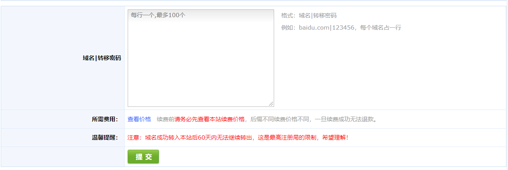

# 域名管理系统

## 一、域名

### 1、概念

(Domain Name)是因特网上一个服务器或一个网络系统的名字，网络间正是通过域名进行访问的。全世界没有重复的域名。如:[sohu.com](https://baike.sogou.com/lemma/ShowInnerLink.htm?lemmaId=17280&ss_c=ssc.citiao.link) sina.com.cn

是互联网络上识别和定位计算机的层次结构式的字符标识，与该计算机的[互联网协议](https://baike.sogou.com/lemma/ShowInnerLink.htm?lemmaId=40950&ss_c=ssc.citiao.link)（IP）地址相对应，通过友好而亲切的名称（如：www.lyge.cn)代替枯燥而难记的IP地址（如：61.155.76.45）以定位相应的计算机和服务  
中文域名：是指含有中文文字的域名

网址=协议+[主机名](https://baike.sogou.com/lemma/ShowInnerLink.htm?lemmaId=7536474&ss_c=ssc.citiao.link)+域名

### 2、域名结构

域名由若干英文单词组成，中间由“·”分隔，从右到左依次为顶级域名段、次高域名段等。

cn：顶级域名,代表某个国家、地区或大型机构。  
com：网络名,也叫二级域名， 代表部门系统或隶属一级区域的下级机构。  
sina：[三级域名](https://baike.sogou.com/lemma/ShowInnerLink.htm?lemmaId=35341&ss_c=ssc.citiao.link),即组织机构名,是本系统、单位或院所的软硬件平台的名称。

## 二、域名管理系统目录

### 1、业务需求

大致分为四个目录：域名管理、抢注管理、账户管理、客服服务

### 2、域名管理

域名管理包括我的域名、模板管理、域名转入、外部入库、批量操作

### 3、抢注管理

抢注管理包括添加预定域名、我预定的域名、我参与的竞价、竞价结束域名、已得标的域名、过期域名提醒

### 4、账户管理

账户管理包括我的账户、操作保护、密码修改、认证中心、站内消息、我的积分

### 5、客服服务

客服服务包括提交问题、我的问题、帮助中心

## 三、域名管理业务设计

### 1、我的域名

### 2、模板管理

### 3、域名转入

### 4、外部入库

### 5、批量操作

## 四、抢注管理业务设计

### 1、添加预定域名

### 2、我预定的域名

### 3、我参加的竞价

### 4、竞价结束域名

### 5、已得标的域名

### 6、过期域名提醒

## 五、账号管理业务设计

### 1、我的账户

### 2、操作保护

### 3、密码修改

### 4、认证中心

### 5、站内消息

### 6、我的积分

## 六、客服服务

### 1、提交问题

### 2、我的问题

### 3、帮助中心

